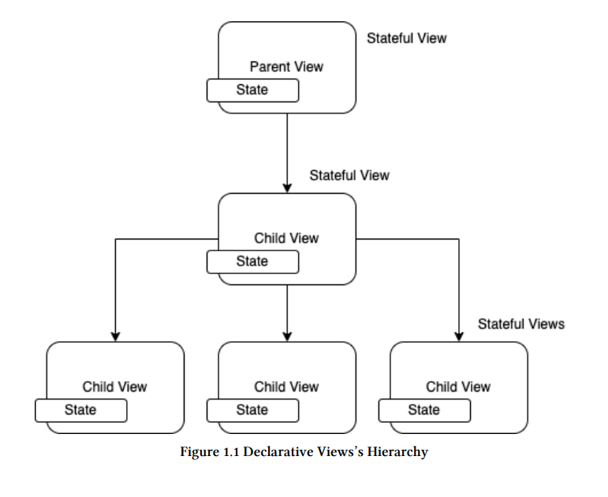
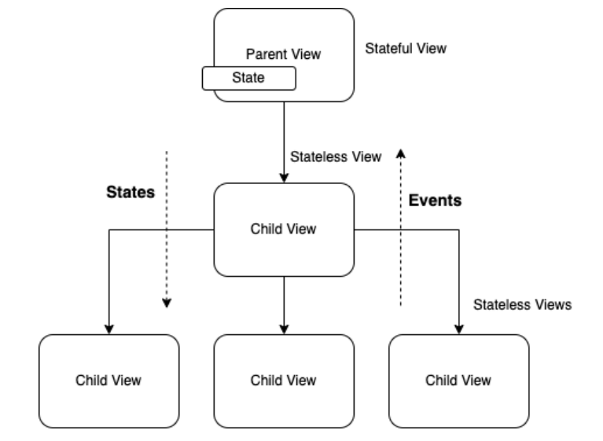
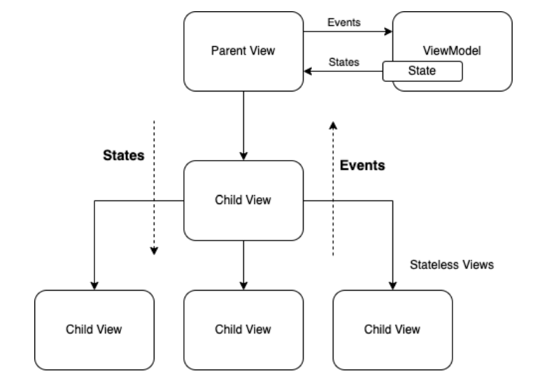
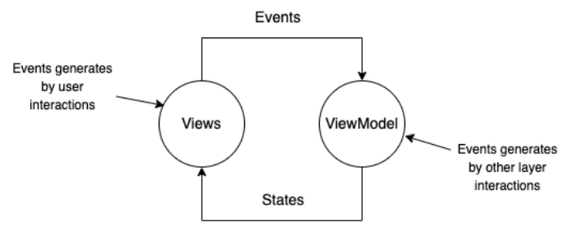
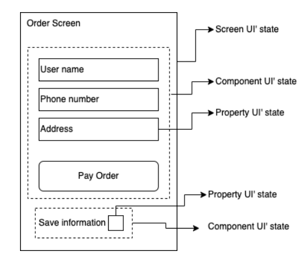
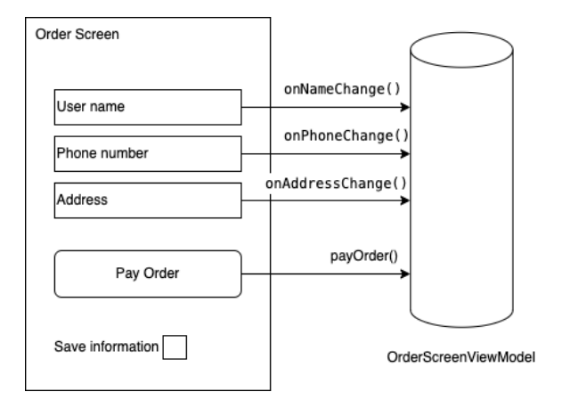
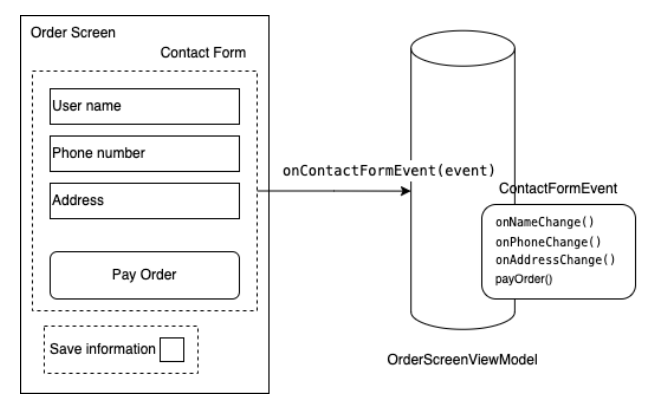

# Глава 1: Принципы проектирования

«Состояние» - сердце декларативных представлений

Первая парадигма, которую мы должны четко представлять при разработке декларативных представлений с помощью таких фреймворков, как ```Compose```
или ```SwiftUI```, является состояние.

Компонент пользовательского интерфейса объединяет в себе графическое представление (View) и состояние.

> Любое свойство или данные, которые изменяются в компоненте пользовательского интерфейса, могут быть представлены в виде состояния.

Например, в UI-компоненте типа ```TextField``` текст, введенный пользователем, является переменной, которая может изменяться;
Поэтому value - это переменная, которая может быть представлена как состояние (name), как показано в следующем коде: 

```kotlin
TextField(
    label = { Text("User name") },
    value = name,
    onValueChange = onNameChange
)
```



Экран мобильного приложения может состоять из иерархии представлений, как показано на рисунке 1.

Каждое представление, в свою очередь, может содержать несколько переменных состояния. Например, все представления на рисунке 1 имеют состояние.

Представления, которые содержат или зависят от состояния, называются ```Stateful Views```, а представления, которые не имеют зависимости от состояния известны как представления без состояния ```Stateless Views```.

И Google, и Apple рекомендуют в качестве хорошей практики разрабатывать, насколько это возможно, представления без состояния, поскольку
следующих преимуществ использования этого типа:
- Их можно использовать повторно.
- Они позволяют делегировать управление состоянием другим компонентам.
- Они функциональны и позволяют избежать побочных эффектов.

Согласно этим рекомендациям, проектирование должно быть ориентировано на представления без состояния и преобразование этих
```stateful views``` в ```stateless views```.


# Применение техники «поднятия состояния» к состояниям делегатов

**Поднятие состояний** - это техника преобразования представлений с состояниями в представления без состояний. Это достигается за счет инверсии
управления, как показано в следующем фрагменте:


```kotlin
    // This is a Stateful View
    @Composable
    fun OrderScreen() {

        var name by remember { mutableStateOf("") }
        var phone by remember { mutableStateOf("") }

        ContactInformation(
            name = name,
            onNameChange = { name = it },
            phone = phone,
            onPhoneChange = { phone = it })
    }

    // This is a Stateless View
    @Composable
    fun ContactInformation(
        name: String,
        onNameChange: (String) -> Unit,
        phone: String,
        onPhoneChange: (String) -> Unit
    ) {

        Column(
            modifier = Modifier
                .fillMaxSize()
                .padding(8.dp),
            horizontalAlignment = Alignment.CenterHorizontally
        ) {
            TextField(
                label = {
                    Text("User name")
                },
                value = name,
                onValueChange = onNameChange
            )
            Spacer(Modifier.padding(5.dp))
            TextField(
                label = {
                    Text("Phone number")
                },
                value = phone,
                onValueChange = onPhoneChange
            )
            Spacer(Modifier.padding(5.dp))
            Button(
                onClick = {
                    println("Order generated for $name and phone $phone")
                },
            ) {
                Text("Pay order")
            }
        }
    }

```

В фрагменте кода управление состоянием имени и телефона делегировано экрану заказа, поэтому ```ContactInformation```
не заботится о состоянии своих данных и может быть повторно использована другими представлениями.
```OrderScreen``` становится stateful, а ```ContactInformation``` - stateless.


```kotlin
@Composable
fun OrderScreen() {

    // States name and phone
    var name by remember { mutableStateOf("") }
    var phone by remember { mutableStateOf("") }

    ContactInformation(
        name = name,
        onNameChange = { name = it },
        phone = phone,
        onPhoneChange = { phone = it })
}

@Composable
fun ContactInformation(
    name: String,
    onNameChange: (String) -> Unit,
    phone: String,
    onPhoneChange: (String) -> Unit,
    payOrder: () -> Unit
) {
    // Code omitted for simplicity
}

```

В примере фрагмента кода инверсия управления достигается с помощью функций высшего порядка, позволяющих
определения состояний и операций передавать в качестве аргументов представлению ```ContactInformation```.


# Определение «источника истины». 

> Кто отвечает за обеспечение состояния?

Для начала давайте уточним, что такое источник истины. Под источником истины понимается надежный источник, предоставляющий данные, которые должны быть представлены на экране и с которыми будет взаимодействовать пользователь.
экрана.

В нашем анализе данные тесно связаны с состояниями. Представления используют состояния для получения информации (данных), необходимой для выполнения их работы.

На рисунке мы видим, как состояния находятся в соответствующих представлениях. Это означает, что каждое представление в указанной диаграмме является источником истины.
Даже имя переменной компонента UI TextField, о котором мы говорили ранее, может быть состоянием и, следовательно, тоже является источником истины.

> Разумно ли иметь так много источников истины в иерархии представлений?
Ответ - нет.


Рекомендуется ограничить источник истины одним компонентом (или минимально возможным), чтобы лучше контролировать поток и избегать несоответствий состояния.
Наличие единственного, четко определенного источника истины также помогает правильно реализовать ```однонаправленный поток данных```, который поддерживается декларативными представлениями, такими как Compose или SwiftUI.

> А как уменьшить количество источников истины в проекте?
Это возможно за счет уменьшения количества представлений ```Stateful``` с помощью техники ```State hoisting```, о которой говорилось
выше, и централизации состояния в одном представлении. 

Как правило, делегат - это представление с самым высоким иерархический уровень, родительское представление.
Например, на рисунке 2 показано, что существует только один источник истины, и это родительское представление.
С одной стороны, дочерние представления отвечают только за распространение событий, полученных при взаимодействии
с пользователем. С другой стороны, они получают состояния, которые будут рендерить представление (рекомпозиция), чтобы отразить изменения в пользовательском интерфейсе.



>Есть ли другой вариант, кроме делегирования всей ответственности за работу с состояниями только одному представлению?
Ответ - да.

Лучший вариант - передать эту ответственность держателю состояния или ```ViewModel```, которая выполняет эту роль.


# ViewModel

## ViewModel как источник истины

Другой компонент призван управлять состоянием, чтобы не перегружать представление обязанностями. Подходящим элементом для этой цели является хорошо известная ```ViewModel```.

Как показано на рисунке 3, перемещение состояний из View в ViewModel создает разделение ответственности, позволяя централизовать логику представления и ее влияние на состояние.



Несмотря на то, что этот компонент (ViewModel) является необязательным в реализации, я настоятельно рекомендую его
поскольку он дает множество преимуществ, таких как эффективное управление жизненным циклом между данными и представлениями.

Для получения дополнительной информации об этом компоненте архитектуры я рекомендую ознакомиться с официальной документацией Google по ViewModels.
Связь между представлением и ViewModel состоит только из двух типов сообщений - ```Events``` и ```States```:

```Events``` - это действия, которые сообщаются ViewModel любым View или Sub-View как следствие пользовательского действия или взаимодействия с компонентами пользовательского интерфейса.

```States``` представляют собой информацию (данные), которую ViewModel доставляет представлениям для их соответствующей
графической интерпретации.

Основная функция ```ViewModel``` - получать события, отправляемые из представлений, интерпретировать их, применять
бизнес-логику и преобразовывать их в состояния для передачи обратно в представления.

Задача представления - получить состояния, отправленные ```ViewModel```, и преобразовать их в графическое представление пользовательского интерфейса
путем рекомпозиции.

Теперь, имея немного больше ясности об ответственности каждого компонента и сообщениях между ними, давайте теперь проанализируем, что происходит с потоком информации


# Понимание потока данных. Паттерн: однонаправленный поток данных

Если мы упростим диаграмму на рисунке 3, то в результате получим следующую диаграмму на рисунке 4:



Это циклическое сообщение между представлением и ```ViewModel```. Поток информации следует только в одном направление, отсюда и название паттерна «Однонаправленный поток данных».

Внешние факторы, которые могут вносить события в этот цикл, - это взаимодействия с пользователем, такие как прокрутка списка, нажатие кнопки
щелчок на кнопке, а также взаимодействие с другими уровнями приложения, например ответ от хранилища или
ответ от пользователя, фоновый таймер или, возможно, поступление push-уведомления.

Цикл не может быть прерван, поскольку любое прерывание или задержка приведут к ухудшению пользовательского опыта.

Пользователь будет воспринимать приложение как медленное, заблокированное и некачественное.

Поэтому при проектировании следует по возможности учитывать следующие правила:

- Составной элемент, определяющий представление, должен быть идемпотентным и функциональным.
- На стороне представления не должно быть задач, замедляющих цикл. Любая задача, требующая длительной обработки должна быть делегирована ``ViewModel``, которая, благодаря реактивному программированию и ```Flow Coroutines```, будет
выполнять эти задачи асинхронно

Теперь, когда вы имеете представление о потоке данных и сообщений, которыми обмениваются ```View``` и ```ViewModel```, логично спросить:

> Как реализован канал связи между View и ViewModel?
Мы рассмотрим это далее.


Давайте соединим компоненты View и ViewModel

Как показано на рисунке 4, два типа каналов связи, которые необходимо реализовать, четко определены

Первый канал - это канал событий, который идет в направлении ```View``` -> ```ViewModel```.

Для этой реализации требуется только, чтобы ```ViewModel``` раскрывала публичные операции, которые могут вызваны представлением, как показано в следующем фрагменте кода 4.

```kotlin
//UI's Events
fun onNameChange(): (String) -> Unit = {
  name = it
}

fun onPhoneChange(): (String) -> Unit = {
  phone = it
}
```

Второй канал - это канал состояний, который идет в направлении ```ViewModel``` -> ```View```.

> Как пользовательский интерфейс узнает, что состояние изменилось?

Наблюдая за состояниями. Чтобы следить за состояниями, сначала ViewModel должна показать их UI через компонент ```mutableStateOf```, например:

```kotlin
 // UI's states
 var name by mutableStateOf("")
 private set
 var phone by mutableStateOf("")
 private set
```

```mutableStateOf``` не только позволит отображать состояние для представления, но и позволит представлению подписаться на уведомление о любых изменениях в этом состоянии.

Давайте посмотрим на полную реализацию ViewModel и View (Composable):

```kotlin
class OrderViewModel : ViewModel() {
    // UI's states
    var name by mutableStateOf("")
    private set
    var phone by mutableStateOf("")
    private set

    //UI's Events
    fun onNameChange(): (String) -> Unit = {
        name = it
    }

    fun onPhoneChange(): (String) -> Unit = {
        phone = it
    }

    fun payOrder(): () -> Unit = {
        println("Order generated for $name and $phone")
    }
}
```


```kotlin
 @Composable
    fun OrderScreen(viewModel: OrderViewModel = viewModel()) {

        ContactInformation(
            name = viewModel.name,
            onNameChange = viewModel.onNameChange(),
            phone = viewModel.phone,
            onPhoneChange = viewModel.onPhoneChange(),
            payOrder = viewModel.payOrder()
        )
    }

    @Composable
    fun ContactInformation(
        name: String,
        onNameChange: (String) -> Unit,
        phone: String,
        onPhoneChange: (String) -> Unit,
        payOrder: () -> Unit
    ) {


        Column(
            modifier = Modifier
                .fillMaxSize()
                .padding(8.dp),
            horizontalAlignment = Alignment.CenterHorizontally
        ) {
            TextField(
                label = {
                    Text("User name")
                },
                value = name,
                onValueChange = onNameChange
            )
            Spacer(Modifier.padding(5.dp))
            TextField(
                label = {
                    Text("Phone number")
                },
                value = phone,
                onValueChange = onPhoneChange
            )
            Spacer(Modifier.padding(5.dp))
            Button(
                onClick = payOrder,
            ) {
                Text("Pay order")
            }
        }
    }
```

До сих пор мы видели, что состояния, такие как name и phone, являются представлениями переменной ```String```; то есть состояние представляет собой примитивную переменную. Однако мы можем расширить представление состояния на компоненты и экранов.

В следующем разделе мы рассмотрим другие варианты представления состояний.

# Структуры, представленные в виде состояний

В Compose и в декларативных представлениях в целом состояния могут представлять различные типы структур пользовательского интерфейса, как показано на рисунке 5 ниже.



- Свойство состояния пользовательского интерфейса: это примитивные переменные, представленные в виде состояний. На рисунке 5 к этому типу относятся поля ввода текста, такие как имя, телефон или адрес. 

- Состояние компонентного пользовательского интерфейса: Представляют собой состояния, связанные с компонентом, который группирует связанные элементы пользовательского интерфейса. Например, на экране заказа компонент под названием ```ContactInformationForm``` может группировать необходимые данные, такие как контактная информация. Этот компонент может иметь состояния NameValueChanged, PhoneValueChanged и SuccessValidated. 
- Состояние пользовательского интерфейса экрана: Представляет собой состояния, связанные с экраном, которые можно рассматривать как абсолютные и независимые состояния; например, экран под названием ```OrderScreen``` может иметь следующие состояния: Загрузка, Загружен успешно или Загрузка не удалась. Теперь давайте посмотрим, какие варианты реализации существуют в Android и Kotlin для определения этих состояний.

Свойство состояния UI - это состояние, объявленное на основе переменной примитивного типа, такой как String, Boolean, List или Int, среди прочих. Если оно объявлено во ViewModel (ViewModel как источник истины), то его определение может выглядеть следующим образом:

```kotlin
var name by mutableStateOf("")
private set

var phone by mutableStateOf("")
private set

var address by mutableStateOf("")
private set

var payEnable by mutableStateO(false)
private set
```

Если он объявлен в View (View как источник истины), то его определение в Composable может быть таким:

```kotlin
var name by remember { mutableStateOf("") }
var phone by remember { mutableStateOf("") }
var address by remember { mutableStateOf("") }
var payEnable by remember { mutableStateOf(false) }
```

```remember``` - это свойство Composable, которое позволяет временно удерживать состояние переменной во время рекомпозиции. Поскольку это Composable, данное свойство может быть определено только в декларативных представлениях, то есть в Composable-функциях. Всегда помните, что для использования делегирования через «by» необходимо импортировать:

```kotlin
import androidx.compose.runtime.getValue
import androidx.compose.runtime.setValue
```

В предыдущих примерах мы говорили только о представлении свойств или переменных через состояния с помощью компонента ```mutableStateOf```. Однако возможно также, что потоки данных могут быть представлены в виде состояний и наблюдаться с помощью Composables. Эти дополнительные возможности связаны с Flow, LiveData и RxJava.


# Состояние компонента пользовательского интерфейса 

Когда у вас есть набор взаимосвязанных элементов пользовательского интерфейса, их состояния могут быть сгруппированы в единую структуру или компонент пользовательского интерфейса с единым состоянием. Например, на рисунке 5 элементы Имя пользователя, Номер телефона, Адрес и даже Кнопка оплаты заказа могут быть сгруппированы в один компонент пользовательского интерфейса, а их состояния представлены в одном состоянии, которое называется, например, FormUiState.


```kotlin
data class FormUiState(
    val nameValueChanged: String = "",
    val phoneValueChanged: String = ""
    val addressValueChanged: String = ""
)

 val FormUiState.successValidated: Boolean get() = nameValueChanged.length > 1  && phoneValueChanged.length > 3
```

В этом случае моделирование нескольких состояний в объединенном классе состояний работает очень хорошо, поскольку переменные связаны между собой и даже определяют значение других переменных. Например, это происходит с переменной ```successValidated```, которая зависит от переменных ```nameValueChanged``` и ```phoneValueChanged```. Консолидация состояний повышает эффективность реализации, централизует управление и упорядочивает код. Именно этот прием будет чаще всего использоваться в нашей реализации. 

# Состояние экранного пользовательского интерфейса 

Если требуется смоделировать состояния, которые могут быть независимыми и принадлежать к одному семейству, можно использовать следующее определение

```kotlin
sealed class OrderScreenUiState {
    data class Success(val order: Order): OrderScreenUiState()
    data class Failed(val message: String): OrderScreenUiState()
    object Loading: OrderScreenUiState()
}
```

Такой тип реализации уместен при работе с абсолютными и эксклюзивными состояниями; вы имеете одно состояние или другое, но не оба одновременно. Как правило, простые экраны такого типа, такие как ```OnboardignScreen``` или ```ResultScreen```, могут быть смоделированы с помощью этих состояний. Если экран более сложный и содержит множество элементов пользовательского интерфейса, которые работают независимо и имеют множество взаимосвязей, я рекомендую читателю предпочесть определение состояний с помощью методов Property UI' state и Component UI' state.

## Моделирование и группировка событий

Возвращаясь к примеру с экраном заказа, мы рассмотрим моделирование событий и то, как их группировать по аналогии с состояниями. Рассмотрим экран, подобный тому, что показан на следующем рисунке:



```ViewModel``` передает представлению четыре операции (события), каждая из которых используется элементом пользовательского интерфейса View. Анализ этих четырех событий связан с формой для ввода контактной информации пользователя, поэтому имеет смысл сгруппировать их в один тип событий, как показано на следующем рисунке:



Реализация для представления различных типов событий может быть такой:

```kotlin
sealed class ContactFormEvent {
    data class OnNameChange(val name: String): FormUiEvent()
    data class OnPhoneChange(val phone: String): FormUiEvent()
    data class OnAddressChange(val address: String): FormUiEvent()
    object PayOrder: FormUiEvent()
}
```

Наконец, не стоит так строго подходить к упрощению состояний или событий. Необходимо проанализировать преимущества и недостатки каждого использования и принять соответствующие решения. Для связанных компонентов пользовательского интерфейса их группировка имеет большой смысл; для некоторых других сквозных элементов полезнее оставить их независимыми. 

# Резюме 

В этой первой главе мы рассмотрели основные концепции, используемые в современной разработке приложений для Android. Такие понятия, как ```состояния``` и ```события```, ```подъем состояний```, ```источник истины``` и ```однонаправленный поток данных```, необходимо понять перед внедрением Jetpack Compose, ViewModels и других архитектурных компонентов, доступных для Android. Именно по этой причине мы начали с этих понятий в этой первой главе. В следующих главах мы рассмотрим определения архитектуры и дизайна в мобильном приложении, для чего будем использовать концепции, представленные в этой главе, в качестве справочника. В дальнейшем будет реализовано мобильное приложение под названием «OrderNow», использующее в качестве концепции электронную коммерцию. В этом приложении будут присутствовать основные элементы электронной коммерции, такие как корзина, список товаров и процесс оформления заказа. Эта работа знакомит читателя с опытом проектирования и разработки, близким к реальному и продуктивному приложению. Но сначала мы применим концепции, изученные в этой главе, для реализации простой формы.
