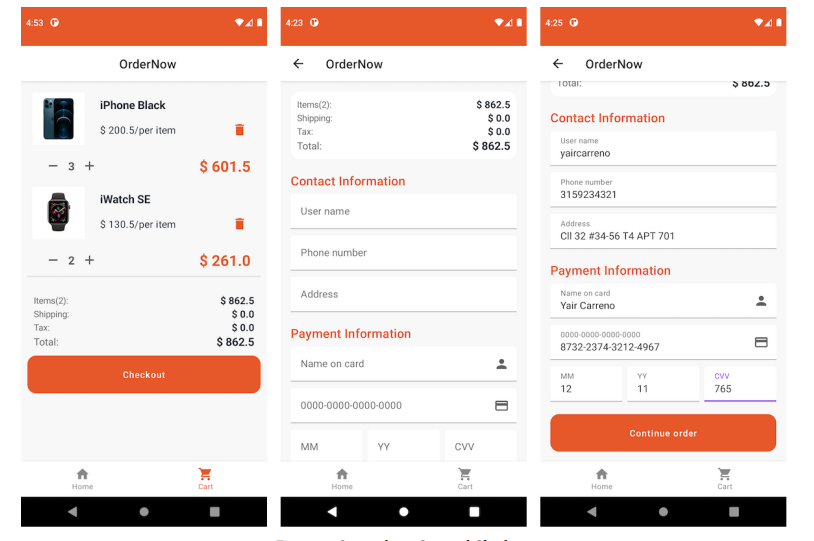
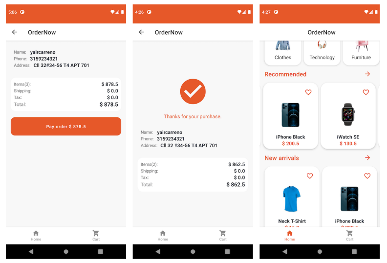

# Глава 3: OrderNow, реальное приложение 

## О приложении 

```OrderNow``` - это пример минимального жизнеспособного продукта (MVP) мобильного приложения для электронной коммерции. Мы будем использовать это приложение в качестве примера для применения концепций, изученных в каждой главе. Реализация решения для электронной коммерции позволит нам ближе познакомиться с задачами, которые ставит перед нами точное и продуктивное приложение. Ниже перечислены основные функции электронной коммерции, которые мы будем развивать в ```OrderNow```:

- Представление списка категорий.
- Представление списка товаров по категориям.
- Представление подробной информации о конкретном продукте.
- Управление товарами (добавление и удаление) в корзине.
- Просматривать список товаров, выбранных для покупки.
- Заполнение информации и данных для совершения покупки (оформление заказа).
- Моделирование процесса оплаты. 

# Экраны 

Экранами, относящимися к различным функциональным возможностям, являются:

- Главная 
- Список товаров 
- Детали товаров 
- Корзина 
- Оформление заказа 
- Размещение заказа

# Home, Product List and Product Detail


# Cart and Checkout



# Place Order




# Технологии

Этот раздел представляет собой краткое изложение технических характеристик ```OrderNow```, чтобы читатель знал, какие инструменты
и руководство по проектированию, которые будут использоваться при реализации.

# Руководство по проектированию и архитектуре

В главах «Глава 1: Принципы проектирования» и «Глава 4: Архитектура приложения» документируются рекомендации по проектированию и
архитектуры, то есть минимальной жизнеспособной архитектуры (MVA), которая будет использована для разработки ```OrderNow```.


## Компоненты архитектуры 

- ```Compose```: Это будет фреймворк для реализации декларативных представлений в нашем презентационном слое. 
- ```ViewModel```: Архитектурный компонент в слое представления, который мы используем для инкапсуляции бизнес-логики. 
- ```Flow```: Мы будем использовать корутины ```Flow``` для реактивного программирования в нашем приложении. ```Flow``` позволит сообщениям между компонентами приложения, как синхронным, так и асинхронным, выполняться наиболее оптимальным образом. 
- ```Навигация```: Архитектурный компонент, который мы будем использовать для реализации навигации по различным экранам нашего приложения. 

# Зависимости 
- ```Coil```: Библиотека для загрузки удаленных или локальных изображений в наше приложение, на языке Kotlin и с поддержкой Jetpack Compose. 


Некоторые темы исключены из содержания  не потому, что они менее важны, а скорее для того, чтобы сузить рамки и достичь конкретных целей. Попытка охватить все связанные с Android-приложением темы может привести к чрезмерному расширению содержания и отвлечь нас от основных концепций, которые должны быть ясны с самого начала.

Следующие возможности не включены и выходят за рамки примера MVP:

 - Руководство по проектированию UI/UX.
 - Компоненты аутентификации и авторизации.
 - Тестирование. 
 - Доступность. 
 
 # Резюме 
 
 В этой небольшой главе кратко описаны технологии и компоненты, использованные при реализации ```OrderNow```. В следующей главе я опишу архитектуру и проектные решения в примере App.