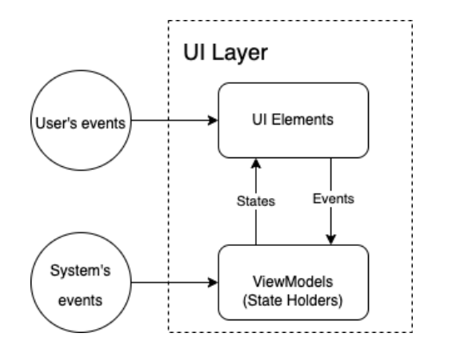
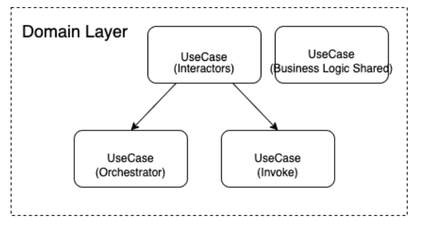
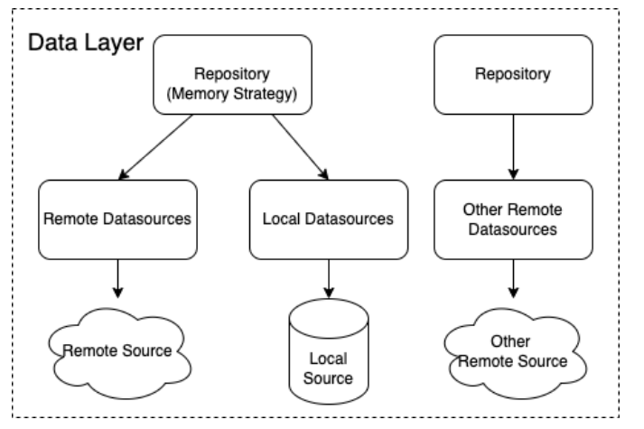
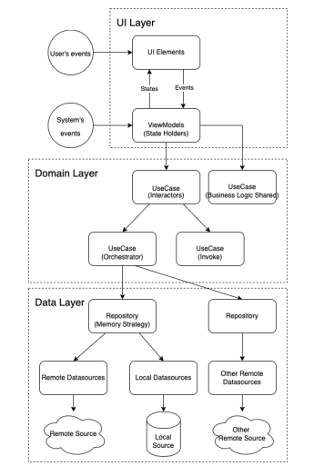
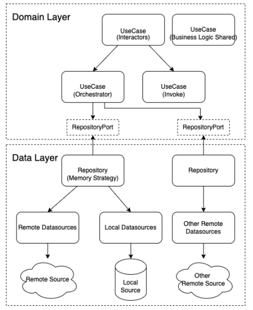
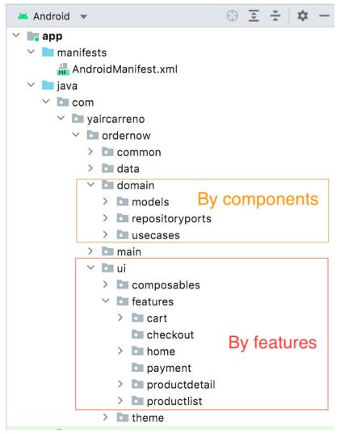
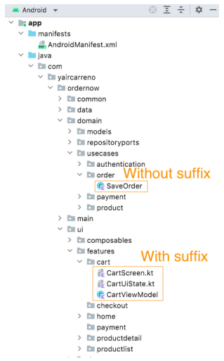
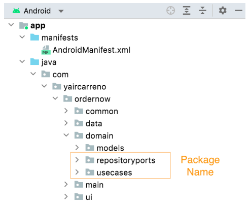
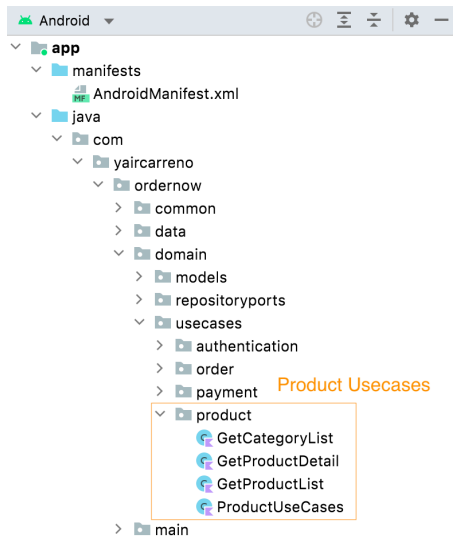
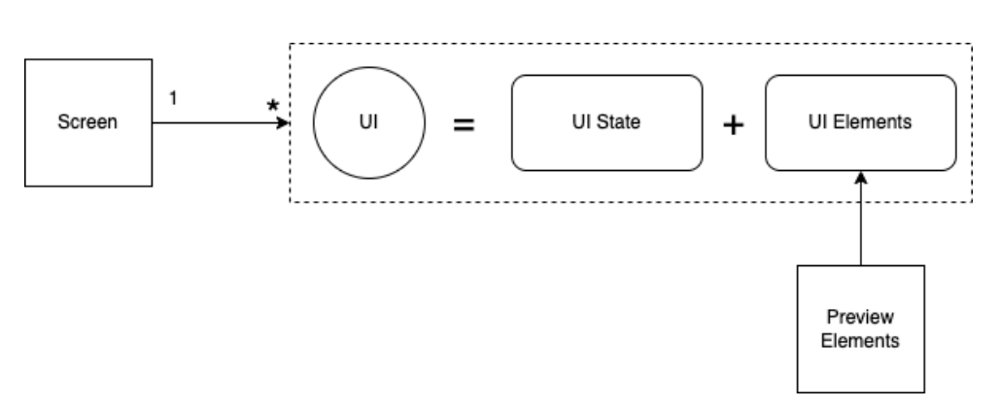

# Глава 4: Архитектура приложения

Выбор стиля Архитектура, которой мы будем следовать при создании ```OrderNow```, основана на передовом опыте и архитектурном руководстве, рекомендованном Google в Guide to app architecture. Эти определения включают некоторые принципы ```Clean Architecture``` для определения компонентов на различных уровнях. Определение слоев В приложении мы определим следующие основные слои: 

- UI Layer 
- Domain Layer 
- Data Layer

## UI Layer 

Этот слой группирует элементы пользовательского интерфейса, представления (композитные функции), ```ViewModels``` и утилиты презентационного слоя, такие как приложения формата и анимации. При проектировании этого слоя необходимо учитывать следующие моменты:

При работе с состояниями следуйте принципам, описанным в главе 1:

Принципы проектирования:
 - Для каждого экрана будет реализована соответствующая ```ViewModel```.
 - ```ViewModel``` также будут функционировать как держатели состояний, то есть менеджеры состояний.
 - Логика навигации будет делегирована представлению и будет зависеть от состояния приложения.
 - Побочные эффекты должны сообщаться ```ViewModel```.
 - ```ViewModel``` должны сохранять свои состояния при изменении конфигурации
 - Приветствуется использование представлений без состояния.




## Слой домена 

Хотя этот слой может быть необязательным, я рекомендую его включить, чтобы сохранить дизайн, соответствующий разделению обязанностей, продиктованному ```Clean Architecture```. Этот слой группирует компоненты, называемые ```UseCases```, которые управляют бизнес-логикой и всей той логикой, которую могут повторно использовать ```ViewModels```. Этот слой также служит мостом между слоем пользовательского интерфейса и слоем данных. Компоненты типа ```Models``` также относятся к этому слою. Эти компоненты моделируют сущности или структуры данных, используемые слоем представления или слоем домена. Например, в ```OrderNow``` и ```Product```, и ```Category``` представляют собой модели или сущности.



При проектировании этого слоя следует учитывать следующие соображения:

- Вся логика представления, дублируемая в представлениях, может быть помещена в ```UseCase```.
- Компоненты, принадлежащие к этому слою, могут быть stateless; это компоненты, не требующие временного сохранения.
- Операции, выполняемые ```UseCase```, должны быть безопасными для основной части.

- ```UseCases``` могут взаимодействовать друг с другом для организации операций.
- Каждый ```UseCases``` отвечает за одну и только одну операцию.
- Каждый ```UseCases``` может использовать один или несколько репозиториев.


## Уровень данных 

На этом уровне сгруппированы компоненты, называемые репозиториями, которые организуют и инкапсулируют логику интеграции с локальными и удаленными источниками данных. Как следует из названия, они следуют шаблону Repository. Другими компонентами этого слоя являются источники данных, ```мапперы``` и ```DTO```. 

- Источник данных: Содержит логику интеграции с внешними или локальными источниками персистентности. 
- ```DTO```: (Data Transfer Object) Это структура, которая моделирует объект персистентности. Содержит определения, используемые механизмом персистентности. Чтобы другие уровни (UI и Domain) не унаследовали эти определения, эти типы сущностей переводятся в модели домена приложения с помощью мапперов. 
- Мапперы: Они преобразуют DTO в модели сущностей доменного слоя. 

При проектировании этого слоя рекомендуется учитывать следующие соображения: 

- Этот слой может использоваться в качестве источника истины. 
- Операции, выполняемые Репозиториями, должны быть безопасными для основных ресурсов. 
- Для каждого первичного типа сущности определяется один репозиторий, например, ```ProductRepository```, ```CategoryRepository```.



## Общая архитектура 

Общая схема с различными интегрированными слоями выглядит следующим образом:




# О других слоях

Другими вспомогательными слоями, дополняющими основные слои архитектуры, будут:

- Main: Содержит базовые артефакты приложения, такие как MainActivity, Application, ApplicationState и другие.
- Общий: Содержит артефакты, относящиеся к различным приложениям, такие как определения навигации, утилиты, используемые для других слоев, менеджер зависимостей и т. д. По поводу использования портов ```Clean Architecture``` рекомендует включать порты между границами различных слоев. Эта техника позволяет инвертировать управление, развязывая компоненты, которые взаимодействуют между границами каждого слоя. Такой подход повышает уровень ремонтопригодности и адаптивности конструкции. В нашем примере приложения (```OrderNow```) будут добавлены порты между слоем домена и слоем данных




# Организация каталогов 

В нашем примере OrderNow для простоты слои будут организованы монолитно через каталоги в одном модуле. Я оставляю на усмотрение читателя, если позже в своих проектах он решит разделить слои, выделив для каждого из них отдельный модуль. Организация по каталогам осуществляется с помощью двух определений:

- В слое UI будет использоваться организация по функциям.

- В Domain Layer и Data Layer будет использоваться организация по компонентам.




# Номенклатура и элементы именования 

Для именования компонентов мы будем использовать следующие правила:

## Использование суффиксов:

Cуффикс будет использоваться в имени компонента только в том случае, если:

- По имени содержащего пакета нельзя определить его тип.
- Необходимо указать тип структуры, которую представляет компонент, например ```ProductRepository```.
- Чтобы избежать путаницы между типами компонентов, например, модель может называться Category, а ее хранилище - CategoryRepository.




## Именование пакетов

Имена пакетов приложений должны быть строчными, без разделителей и заглавных букв.



## Именование компонентов

Для названия компонентов типа ```UseCases``` в качестве префикса используется действие, представляющее операцию в случае использования (do, get, update, save, send, delete, add).




## Именование композитных функций



Для определения компонентов пользовательского интерфейса, то есть функций Composables, будут использоваться следующие обозначения, за основу которых взята документация Google в руководстве по архитектуре:

Screen: Суффикс, используемый для композитов, которые представляют весь экран. 

UI: Суффикс, используемый для компонентов, которые объединяют состояния представления (UI State) с графическим представлением компонентов (UI Elements). 

Elements: Суффикс, используемый для составных элементов, определяющих компоненты библиотеки пользовательского интерфейса (кнопки, макеты, флажки, текстовые поля и т. д.), из которых состоит представление. 

Preview: Префикс, используемый для композитов предварительного просмотра представлений (Elements). Составные элементы экрана и пользовательского интерфейса также могут быть предварительно просмотрены, но это становится более сложным из-за зависимости от состояний и других переменных. Следует помнить, что могут быть исключения, когда не обязательно определять все типы композитов и опускать определение некоторых. В зависимости от степени сложности экранов будет решено, какие из них применимы, а какие нет. 

# Резюме 

В этой главе я хотел описать определения архитектуры, которым необходимо следовать перед началом реализации. Также были разъяснены правила, используемые для организации проекта приложения. Должен оговориться, что определения, приведенные в этой главе, являются рекомендациями. Читатель сможет внести свои коррективы или использовать те соглашения и правила, которые ему больше подходят или с которыми он чувствует себя комфортно в своих реализациях. В следующей главе мы приступим к реализации ```OrderNow```, и первое, что будет построено, - это его скелет, то есть основная структура.  