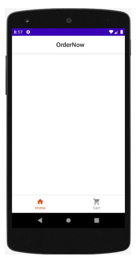

# Глава 5: Скелет: Основная структура. Создание экранов и ViewModels 

В предыдущих главах мы уже разобрали теоретические концепции и организацию, которую мы придадим проекту ```OrderNow```. В этой главе мы начнем с реализации начальной структуры и шаблона, который будет объединять все части приложения. 

Первым шагом будет добавление следующих основных экранов с соответствующими ```ViewModels```:

- Главная 
- Список товаров 
- Детализация товаров 
- Корзина 

Пример добавленных элементов показан на следующем рисунке:


Мы будем использовать менеджер зависимостей ```Hilt``` в приложении, чтобы привязать каждую ViewModel к соответствующему экрану.
Для этого мы должны сначала установить ```Hilt``` в приложение, как указано в статье Google Установка Hilt.
В процессе установки Hilt будет запрошено определение класса типа ```Application```, который в нашем примере это будет ```OrderNowApplication```, как показано ниже:

```kotlin
@HiltAndroidApp
class OrderNowApplication: Application()
```

Не забудьте также зарегистрировать класс ```OrderNowApplication``` в файле AndroidManifiest.xml: 

```xml
<application
    android:name=".main.OrderNowApplication"
    android:allowBackup="true"
 ... >

```

Кроме того, мы устанавливаем в проект библиотеку ```Navigation Compose```, которая позволит представлению (Composable) получать экземпляр соответствующей ```ViewModel``` во время навигации:

```
dependencies {
    implementation 'androidx.hilt:hilt-navigation-compose:1.0.0'
}
```

После того как предыдущая настройка в проекте выполнена правильно, мы можем внедрить ```ViewModel``` в представление следующим образом³¹:

```kotlin
@HiltViewModel
class HomeViewModel @Inject constructor() : ViewModel() {
...
 }
```

```kotlin
@Composable
    fun HomeScreen(viewModel: HomeViewModel = hiltViewModel()
    ) {
    ...
    }
```

Каждый экран будет связан с соответствующей ViewModel через менеджер зависимостей ```Hilt```. До этого момента мы интегрировали следующие компоненты архитектуры: ```Compose```, ```Navigation``` и ```ViewModel```. Это идеальное сочетание инструментов с помощью Jetpack, и в последующих главах мы увидим его потенциал в мобильной разработке.


# Паттерны пользовательского интерфейса: TopAppBar и BottomAppBar 


С помощью компонента ```Scaffold``` мы можем реализовать в наших приложениях два наиболее распространенных паттерна пользовательского интерфейса в Material Design: ```TopAppBar``` и ```BottomAppBar```. 

```Scaffold``` - это детальное представление (композитное), которое позволит нам реализовать эти паттерны следующим образом: 

```kotlin
Scaffold(
    topBar = {
        TopAppBar { /* Top app bar content */ }
    },
    bottomBar = {
        BottomAppBar { /* Bottom app bar content */ }
    }
 ) 
 { contentPadding ->
    // Screen content
 } 
```

Легко, не правда ли? В фрагменте кода мы определяем ```topBar```, ```bottomBar``` и (еще не добавленное) содержимое экрана. В ```Scaffold``` секции ```topBar``` и ```bottomBar``` являются необязательными; то есть определение некоторых из этих частей можно опустить. Кроме того, в ```Scaffold``` есть еще два компонента, которые мы можем объявить:

- ```scaffoldState``` - snackbarHost В следующей главе мы увидим, как используется каждый из них. А сейчас давайте ограничимся определением topBar и bottomBar. Теперь, когда мы знаем, как включить эти шаблоны пользовательского интерфейса в наше приложение, следующим шагом будет создание представлений (composables), представляющих ```TopAppBar``` и ```BottomAppBar```. Организуется каталог под названием patterns, и в него добавляются два представления, ```OrderNowTopBar``` и ```OrderNowBottomBar```, следующим образом: 


# OrderNowTopBar 

Реализация ```OrderNowTopBar``` очень проста. Изначально нам нужно реализовать его следующим образом:

```kotlin
import androidx.compose.foundation.layout.fillMaxWidth
import androidx.compose.material.*
import androidx.compose.runtime.Composable
import androidx.compose.ui.Modifier
import androidx.compose.ui.res.stringResource
import androidx.compose.ui.text.style.TextAlign
import com.example.ordernow.R.string as AppString

@Composable
fun OrderNowTopBar() {
    TopAppBar(
        title = {
            Text(
                text = stringResource(id = AppString.app_name),
                textAlign = TextAlign.Center,
                modifier = Modifier.fillMaxWidth()
            )
        },
        backgroundColor = MaterialTheme.colors.background,
        contentColor = contentColorFor(MaterialTheme.colors.background)
    )
}
```

Предыдущая реализация пока не содержит таких элементов, как опция возврата назад; однако в разделе «Добавление Назад на панель TopAppBar» в главе 7 она будет включать такую опцию навигации с помощью стратегии, использующей состояние.

# OrderNowBottomBar 

Реализация ```OrderNowBottomBar``` может быть немного более сложной, поскольку нам нужно включить навигацию между экранами. Пока же мы приведем статическое определение без навигации.

```kotlin
import androidx.compose.material.*
import androidx.compose.material.icons.Icons
import androidx.compose.material.icons.filled.Home
import androidx.compose.material.icons.filled.ShoppingCart
import androidx.compose.runtime.Composable
import androidx.compose.runtime.mutableStateOf
import androidx.compose.runtime.remember
import androidx.compose.ui.graphics.Color
import androidx.compose.ui.unit.dp
import com.example.ordernow.ui.theme.OrderNowTheme

@Composable
fun OrderNowBottomBar() {
    val selectedIndex = remember { mutableStateOf(0) }
    BottomNavigation(
        backgroundColor = MaterialTheme.colors.background,
        contentColor = contentColorFor(MaterialTheme.colors.background),
        elevation = 10.dp
    ) {
        BottomNavigationItem(icon = {
            Icon(imageVector = Icons.Default.Home, "")
        },
            label = { Text(text = "Home") },
            selected = (selectedIndex.value == 0),
            unselectedContentColor = Color.Gray,
            selectedContentColor = Color.Green,
            onClick = {
                selectedIndex.value = 0
            })

        BottomNavigationItem(icon = {
            Icon(imageVector = Icons.Default.ShoppingCart, "")
        },
            label = { Text(text = "Cart") },
            selected = (selectedIndex.value == 1),
            unselectedContentColor = Color.Gray,
            selectedContentColor = Color.Green,
            onClick = {
                selectedIndex.value = 1
            })
    }
}
```

На данный момент у нас уже есть определения экранов, ```ViewModels``` и ```Scaffold``` (который включает ```OrderNowBottomBar``` и ```OrderNowTopBar```). Следующий шаг - собрать все части воедино, и мы сделаем это в следующем разделе.

# Собираем все вместе 

Первой задачей является создание каталога под названием main. Эта директория будет сквозной и будет содержать базовые классы или структуры приложения. Внутри этой директории мы разместим класс ```Application```, переместим туда ```MainActivity``` и главный экран приложения, который мы назовем ```OrderNowScreen```, как показано на следующем изображении.


Теперь мы изменим класс ```MainActivity.kt``` так, чтобы он загружал экран входа в приложение ```OrderNowScreen``` следующим образом:

```kotlin
@AndroidEntryPoint
class MainActivity : ComponentActivity() {
    override fun onCreate(savedInstanceState: Bundle?) {
        super.onCreate(savedInstanceState)
        enableEdgeToEdge()
        setContent {
            OrderNowScreen()
        }
    }
}


@Preview(showBackground = true)
@Composable
fun OrderNowScreenPreview() {
    OrderNowScreen()
}
```

Затем в представлении ```OrderNowScreen``` мы определяем Scaffold нашего приложения следующим образом:

```kotlin
@Composable
fun OrderNowScreen() {
    OrderNowTheme {
        Surface(
            modifier = Modifier.fillMaxSize(),
            color = MaterialTheme.colorScheme.background
        ) {
            Scaffold(
                topBar = { OrderNowTopBar() },
                bottomBar = { OrderNowBottomBar() }
            ) { contentPadding ->
                println(contentPadding)
            }
        }
    }
}
```

Когда вы запустите приложение, результат должен быть похож на следующее изображение:



# Резюме

В этой главе мы создали начальную структуру проекта ```OrderNow```. Определенные и реализованные здесь компоненты станут основой для продолжения работы над навигацией в следующей главе. По мере продвижения по главам мы будем улучшать реализацию каждого компонента ```OrderNow```, чтобы в результате наша электронная коммерция была спроектирована и реализована наилучшим образом. 