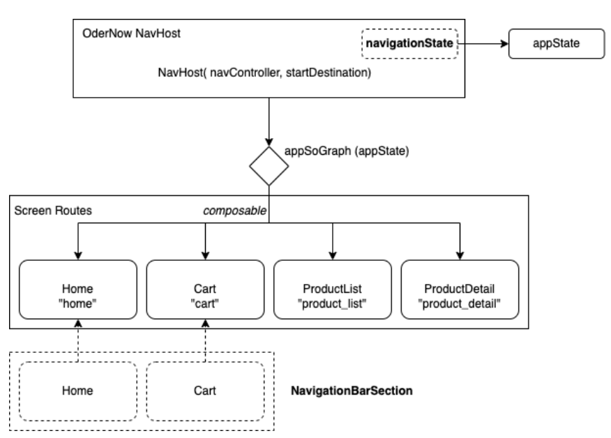

# Глава 6: Проектирование навигации в приложении

В реализации, сделанной в предыдущей главе, «Скелет: Основная структура, было установлено несколько компонентов архитектуры Jetpack, которые будут использоваться в этой главе.

Это такие компоненты, как ```Composables```, ```ViewModels```, ```Navigation``` и ```Hilt```. Кроме того, мы оставили базовую структуру, включающую шаблоны пользовательского интерфейса ```TopAppBar``` и ```BottomAppBar``` с помощью ```Scaffold```.

Чтобы продолжить совершенствование реализации, нам нужно добавить новую ключевую вкладку «Общее состояние приложения». 

## Состояние приложения: Общее состояние

В первой главе «Принципы проектирования» мы обсудили важную роль состояния в современных Android-приложениях.

Три типа состояний, которые могут существовать в дизайне:
- состояние пользовательского интерфейса свойств,
- состояние пользовательского интерфейса компонентов
- состояние пользовательского интерфейса экрана состояние.

В дополнение к этим состояниям мы можем определить новый тип состояния - ```состояние приложения```.

Это новое состояние будет определять общее состояние приложения. Оно будет использоваться для навигации между экранами, представления спонтанных сообщений (snackbars) и других доступных процессов в приложении.

В основной директории мы определим класс ```OrderNowState```, который будет нашим держателем состояния, который который будет представлять этот тип состояния.


Далее мы выполним начальную реализацию ```OrderNowState``` следующим образом:

```kotlin
@Composable
fun rememberAppState(
    scaffoldState: ScaffoldState = rememberScaffoldState(),
    navController: NavHostController = rememberNavController(),
    resources: Resources = resources(),
    coroutineScope: CoroutineScope = rememberCoroutineScope()
) = remember(
    scaffoldState,
    navController,
    resources,
    coroutineScope
) {
    OrderNowState(scaffoldState, navController, resources, coroutineScope)
}

class OrderNowState(
    val scaffoldState: ScaffoldState,
    val navController: NavHostController,
    private val resources: Resources,
    coroutineScope: CoroutineScope
)
```

А позже мы изменим наше представление ```OrderNowScreen```, чтобы включить в него ранее определенное состояние, как показано ниже:

```kotlin
@Composable
fun OrderNowScreen() {
    OrderNowTheme {
        Surface(
            modifier = Modifier.fillMaxSize(),
            color = MaterialTheme.colors.background
        ) {
            val appState = rememberAppState()
            Scaffold(
                scaffoldState = appState.scaffoldState,
                topBar = { OrderNowTopBar() },
                bottomBar = { OrderNowBottomBar(navController = appState.navController) }
            ) { contentPadding ->
                OrderNowNavHost(appState, contentPadding)
            }
        }
    }
}

@Composable
@ReadOnlyComposable
fun resources(): Resources {
    LocalConfiguration.current
    return LocalContext.current.resources
}

```

Примечание: Также необходимо добавить в ```OrderNowScreen``` функцию ```resources```, с помощью которой он будет обращаться к ресурсам приложения.

Ниже приведены строки кода, в которых можно выделить это изменение

```kotlin
val appState = rememberAppState()

 Scaffold(
 scaffoldState = appState.scaffoldState,
 ...
 ) { contentPadding ->
 ...
 }
```

С помощью приведенного выше кода мы можем указать ```Scaffold```, какое состояние он должен взять в качестве ссылки: состояние приложения. Это впоследствии позволит осуществлять последовательную навигацию между представлениями, представлять спонтанные сообщения,
и другие эксклюзивные задачи представления, принимающего в качестве источника истины только ```AppState```.

Теперь, когда состояние ```App``` определено, мы можем приступить к реализации навигации приложения.


## Определение навигационной карты

Стратегия навигации, которую мы используем в приложении, состоит из следующих элементов:

- ```NavHost```: Это компонент, отвечающий за отображение результата навигации в представлении. Результат навигации определяется контроллером навигации и определениями, заданными в
графе навигации.

- ```AppSoGraph```: Является реализацией графа навигации. Указывается представление или компонент, к которому он
должен направлять навигацию в соответствии с заданным маршрутом.


## Экранные маршруты:

Это различные экраны приложения, на которые можно попасть с помощью навигации. Неважно, активируется ли навигация из меню опций, ссылки, кнопки или любого другого активного
агент. Каждый из этих экранов будет иметь уникальный маршрут, связанный с ним.


Далее мы рассмотрим, как включить каждый из этих элементов в ```OrderNow```.


# OrderNowScreenRoute
Сначала создается новый каталог обхода под названием common -> navigation. В этот пакет мы добавляем класс под названием
```OrderNowScreenRoute``` следующим образом:


В рамках этого класса экраны, на которые можно переходить, определяются следующим образом:

```kotlin
package com.example.ordernow.common.navigation

sealed class OrderNowScreenRoute (val route: String) {

    companion object {
        val withArrowBack = listOf(
            ProductDetail
        )
    }

    object Home : OrderNowScreenRoute("home")
    object Cart : OrderNowScreenRoute("cart")
    object ProductList : OrderNowScreenRoute("product_list")
    object ProductDetail : OrderNowScreenRoute("product_detail")
}
```

# OrderNowNavHost y AppSoGraph

Теперь создадим класс ```OrderNowNavHost```, который будет представлять NavHost приложения следующим образом:


```kotlin

@Composable
fun OrderNowNavHost(
    appState: OrderNowState,
    paddingValues: PaddingValues
) {
    NavHost(
        navController = appState.navController,
        startDestination = NavigationBarSection.Home.route,
        modifier = Modifier.padding(paddingValues)
    ) {
        appSoGraph(appState)
    }
}

fun NavGraphBuilder.appSoGraph(appState: OrderNowState) {

    // Home Screen Graph
    composable(NavigationBarSection.Home.route) {
        HomeScreen()
    }

    // Cart Screen Graph
    composable(NavigationBarSection.Cart.route) {
        CartScreen()
    }

    // Product List Screen Graph
    composable(OrderNowScreenRoute.ProductList.route) {
        ProductList()
    }

    // Product Detail Screen Graph
    composable(OrderNowScreenRoute.ProductDetail.route) {
        ProductDetailScreen()
    }
}

```

Из предыдущего кода, следует выделить следующие определения:

- ```OrderNowNavHost``` требует знания состояния приложения.
- ```NavController``` размещается и берется из состояния приложения.
- Навигационная карта (```appSoGraph```), будет создана на основе состояния приложения и является расширением, определенным
в ```OrderNowNavHost```.
Чтобы продолжить и закончить реализацию навигации в OrderNow, мы должны добавить вспомогательный класс
описанный ниже.

# NavigationBarSection

```NavigationBarSection``` - это вспомогательный класс, представляющий группу экранирования, которая составляет меню нижней панели приложения.
Помните, что мы можем начать навигацию с действий в меню опций или других компонентов пользовательского интерфейса, таких как ссылки, кнопки или внутренние перенаправления.

В следующем разделе мы сделаем изменения для внутренних перенаправлений (из кнопок, ссылок и т. д.), а пока,
давайте сосредоточимся на навигации из ```BottomBar```.


На рисунке мы видим, как вспомогательный класс ```NavigationBarSection``` группирует только экраны ```Home``` и ```Cart```, которые мы хотим включить из меню ```BottomBar```.

Этот класс будет помещен в каталог навигации следующим образом:


А его реализация будет выглядеть следующим образом:

```kotlin
sealed class NavigationBarSection(
    @StringRes val title: Int,
    val icon: ImageVector,
    val route: String
) {
    companion object {
        val sections = listOf(
            Home,
            Cart
        )
    }

    object Home : NavigationBarSection(
        title = AppText.app_name,
        icon = Icons.Filled.Home,
        route = OrderNowScreenRoute.Home.route
    )

    object Cart : NavigationBarSection(
        title = AppText.app_name,
        icon = Icons.Filled.ShoppingCart,
        route = OrderNowScreenRoute.Cart.route
    )
}
```

Добавив в проект класс-помощник, мы обновляем класс OrderNowNavHost следующим образом:

```kotlin
@Composable
fun OrderNowNavHost(
    appState: OrderNowState,
    paddingValues: PaddingValues
) {
    NavHost(
        navController = appState.navController,
        startDestination = NavigationBarSection.Home.route,
        modifier = Modifier.padding(paddingValues)
    ) {
        appSoGraph(appState)
    }
}

fun NavGraphBuilder.appSoGraph(appState: OrderNowState) {

    // Home Screen Graph
    composable(NavigationBarSection.Home.route) {
        HomeScreen()
    }

    // Cart Screen Graph
    composable(NavigationBarSection.Cart.route) {
        CartScreen()
    }

    // Product List Screen Graph
    composable(OrderNowScreenRoute.ProductList.route) {
        ProductList()
    }

    // Product Detail Screen Graph
    composable(OrderNowScreenRoute.ProductDetail.route) {
        ProductDetailScreen()
    }
}
```

В предыдущем фрагменте кода реализация функции ```appSoGraph``` является расширением ```NavGraphBuilder```, и в ней мы задаем карту навигации для каждого экрана приложения.

Кроме того, через параметр ```startDestination``` указывается экран по умолчанию, который будет представлен первым, то есть главный экран.

Следующим шагом для внедрения изменений будет обновление класса ```OrderNowBottomBar``` следующим образом:

```kotlin
import androidx.compose.material.*
import androidx.compose.runtime.Composable
import androidx.compose.runtime.getValue
import androidx.compose.ui.graphics.Color
import androidx.compose.ui.res.stringResource
import androidx.compose.ui.unit.dp
import androidx.navigation.NavDestination.Companion.hierarchy
import androidx.navigation.NavGraph.Companion.findStartDestination
import androidx.navigation.NavHostController
import androidx.navigation.compose.currentBackStackEntryAsState
import com.example.ordernow.common.navigation.NavigationBarSection

@Composable
fun OrderNowBottomBar(navController: NavHostController) {

    val navBackStackEntry by navController.currentBackStackEntryAsState()
    val currentDestination = navBackStackEntry?.destination
    BottomNavigation(
        backgroundColor = MaterialTheme.colors.background,
        contentColor = contentColorFor(MaterialTheme.colors.background),
        elevation = 10.dp
    ) {
        NavigationBarSection.sections.forEach { section ->
            val selected =
                currentDestination?.hierarchy?.any {
                    it.route == section.route
                } == true
            BottomNavigationItem(
                icon = {
                    Icon(
                        imageVector = section.icon,
                        contentDescription = stringResource(section.title)
                    )
                },
                label = { Text(text = stringResource(section.title)) },
                selected = selected,
                unselectedContentColor = Color.Gray,
                selectedContentColor = Color.Blue,
                onClick = {
                    navController.navigate(section.route) {
                        popUpTo(navController.graph.findStartDestination().id) {
                            saveState = true
                        }
                        launchSingleTop = true
                        restoreState = true
                    }
                })
        }
    }
}

```

Для каждого элемента, добавленного в секцию ```NavigationBarSection```, в ```BottomBar``` будет отображаться опция. Эта реализация ```OrderNowBottomBar``` чище, чем та, что была сделана в предыдущей главе.

Затем мы снова обновляем представление ```OrderNowScreen``` следующим образом:

```kotlin
@Composable
fun OrderNowScreen() {
    OrderNowTheme {
        Surface(
            modifier = Modifier.fillMaxSize(),
            color = MaterialTheme.colors.background
        ) {
            val appState = rememberAppState()
            Scaffold(
                scaffoldState = appState.scaffoldState,
                topBar = { OrderNowTopBar() },
                bottomBar = { OrderNowBottomBar(navController = appState.navController) }
            ) { contentPadding ->
                OrderNowNavHost(appState, contentPadding)
            }
        }
    }
}
```
Теперь ```OrderNowBottomBar``` будет требовать ссылку на ```navController```, отвечающий за навигацию.

В секции содержимого ```Scaffold``` добавляется экземпляр ```OrderNowNavHost```, который получает в качестве параметра общеее состояние приложения в качестве параметра, как показано в фрагменте кода


После этих изменений приложение должно запуститься, как показано на рисунке


# Навигация из других элементов пользовательского интерфейса

Теперь, когда у нас есть готовая реализация навигации из опций ```BottomBar```, нам нужны определения для навигации по приложению из других элементов пользовательского интерфейса, таких как кнопки, ссылки, глубокие ссылки или даже
программно по запросу других внутренних компонентов приложения.

Первое изменение, которое мы сделаем, - добавим структуру ```OrderNowNavigationState```, которая позволит
нам расширить общее состояние приложения.


```OrderNowNavigationState```, являются расширениями общего состояния приложения, то есть группой расширений состояния
```OrderNowState```, используемых для целей навигации. Мы также будем использовать эту структуру для централизации в ней
навигационной логики, которая зависит от состояния.



Реализация ```OrderNowNavigationState``` будет выглядеть следующим образом:

```kotlin
package com.example.ordernow.common.navigation

import com.example.ordernow.main.OrderNowState

fun OrderNowState.popUp() {
    navController.popBackStack()
}

fun OrderNowState.navigate(route: String) {
    navController.navigate(route) {
        launchSingleTop = true
    }
}

fun OrderNowState.navigateAndPopUp(route: String, popUp: String) {
    navController.navigate(route) {
        launchSingleTop = true
        popUpTo(popUp) { inclusive = true }
    }
}

fun OrderNowState.navigateSaved(route: String, popUp: String) {
    navController.navigate(route) {
        launchSingleTop = true
        restoreState = true
        popUpTo(popUp) { saveState = true }
    }
}

fun OrderNowState.clearAndNavigate(route: String) {
    navController.navigate(route) {
        launchSingleTop = true
        popUpTo(0) { inclusive = true }
    }
}

```

Несколько изменений вносятся в экраны ```Home```, ```ProductList``` и ```ProductDetail```, как показано на следующем рисунке


Например, в режиме «Дом» действие навигации выполняется с помощью кнопки следующим образом:

```kotlin
package com.example.ordernow.ui.features.home

import androidx.compose.foundation.layout.*
import androidx.compose.material.*
import androidx.compose.runtime.Composable
import androidx.compose.ui.Alignment
import androidx.compose.ui.Modifier
import androidx.compose.ui.graphics.Color
import androidx.compose.ui.res.stringResource
import androidx.compose.ui.tooling.preview.Preview
import androidx.compose.ui.unit.dp
import androidx.hilt.navigation.compose.hiltViewModel
import com.example.ordernow.R.string as AppText

@Composable
fun HomeScreen(
    goToProductList: () -> Unit,
    modifier: Modifier = Modifier,
    viewModel: HomeViewModel = hiltViewModel()
) {
    Column(
        modifier = modifier.fillMaxSize(),
        horizontalAlignment = Alignment.CenterHorizontally,
        verticalArrangement = Arrangement.Center
    ) {
        Text(
            text = stringResource(id = AppText.home),
            style = MaterialTheme.typography.body1
        )
        Spacer(modifier = Modifier.padding(50.dp))
        Button(
            onClick = goToProductList,
            modifier = Modifier.align(Alignment.CenterHorizontally),
            colors = ButtonDefaults.buttonColors(
                backgroundColor = Color.Blue,
                contentColor = Color.White
            )
        ) {
            Text(text = stringResource(id = AppText.to_product_list_screen))
        }
    }
}

@Preview
@Composable
fun HomeScreenPreview() {
    HomeScreen(goToProductList = {})
}
```

Важной частью фрагмента кода является определение действия ```onClick = goToProductList``` кнопки
кнопки «Go to -> ProductList Screen», где с помощью техники поднятия состояния, описанной в главе "Принципы проектирования", мы делегируем действие ```goToProductList``` навигационной карте ```appSoGraph```, определенной в
```OrderNowNavHost```, следующим образом:

```kotlin
fun NavGraphBuilder.appSoGraph(appState: OrderNowState) {
   val goToListFromHome: () -> Unit = {
   appState.navigateSaved(OrderNowScreenRoute.ProductList.route,
   OrderNowScreenRoute.Home.route)
 }

 // Home Screen Graph
 composable(NavigationBarSection.Home.route) {
 HomeScreen(goToProductList = goToListFromHome)
 }

 ...
 }
```

Напомним, что функция ```navigateSaved``` является частью расширений, определенных в структуре под названием ```OrderNowNavigationState```.

Аналогичная реализация применяется для навигации по другим экранам ```ProductList``` и ```ProductDetail``` таким образом.
что производительность в ```OrderNowNavHost``` следующая:

```kotlin
fun NavGraphBuilder.appSoGraph(appState: OrderNowState) {

 val homeRoute = OrderNowScreenRoute.Home.route
 val listRoute = OrderNowScreenRoute.ProductList.route
 val detailRoute = OrderNowScreenRoute.ProductDetail.route

 val goToListFromHome: () -> Unit = {
 appState.navigateSaved(listRoute, homeRoute)
 }

 val goToDetailFromList: () -> Unit = {
 appState.navigateSaved(detailRoute, listRoute)
 }
val goBack: () -> Unit = {
 appState.popUp()
 }

 composable(NavigationBarSection.Home.route) {
 HomeScreen(goToProductList = goToListFromHome)
 }

 composable(NavigationBarSection.Cart.route) {
 CartScreen()
 }

 composable(OrderNowScreenRoute.ProductList.route) {
 ProductListScreen(goToProductDetail = goToDetailFromList)
 }

composable(OrderNowScreenRoute.ProductDetail.route) {
 ProductDetailScreen(goToBack = goBack)
 }
 }

```

В общем, это будут навигационные определения (навигационная карта), настроенные в предыдущем коде
фрагмент кода:

- Переход с главного экрана на экран ```ProductList```.
- Переход от экрана ```ProductList``` к экрану ```ProductDetail```.
- Переход с экрана ```ProductDetail``` на ранее представленный экран.
- Переход из меню ```BottomBar``` на главный экран.
- Перейдите из меню ```BottomBar``` на экран ```Cart```.


На данный момент у нас уже есть отличная базовая реализация навигации в приложении ```OrderNow```. Однако, чего-то не хватает.
Есть идеи, чего может не хватать?

Мы должны включить в навигацию передачу данных или информации между экранами.

Это будет очень легко сделать благодаря реализации, которую мы разработали в этой главе, и мы
как это сделать в главе 7: Реализация «возможностей».


# Резюме

В этой главе мы завершили разработку основных частей приложения, которые станут
фундаментом для последующего добавления функциональных возможностей.
Мы знаем, что навигация - важнейшая часть приложения и что мы должны учитывать ее с самого начала проектирования приложения.
В этой главе мы использовали рекомендации Google по учету состояния при создании навигационной логики.

Кроме того, читатель может оценить, что мы не вовлекаем ```ViewModel``` или View напрямую в нашу стратегию. Это это делает ее гибкой для проверки навигации в целях тестирования.
