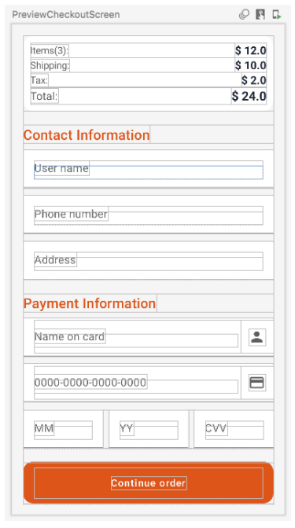

# Chapter 7: Implementing “Features”

## Before starting

И наконец, мы подошли к части реализации функциональных возможностей.
Первым экраном, который мы реализуем, будет главный или основной экран приложения, как показано на рисунке


Однако прежде чем приступить к реализации экрана, необходимо задать себе следующие вопросы:
- Какая информация или данные требуются представлению?
- Как эти данные будут управляться в представлении?
- Откуда берутся данные, используемые представлением?

Приведенные выше рассуждения справедливы, если мы проектируем декларативные представления на Android или iOS (да, я знаю, что это
это разработка на Android, но мы не можем игнорировать хорошие практики, которые могут применяться между одной экосистемой и
другой).


> Какая информация или данные требуются для просмотра?

Категории и продукты.

> Как эти данные будут управляться в представлении?
Они будут представлены в виде информации запроса в форме списка и горизонтальных каруселей.

> Откуда берутся данные, используемые представлением?

Они должны поступать из источника истины, которым в данном примере будут хранилища на уровне данных.

Три вышеперечисленных вопроса кажутся несколько тривиальными, однако они говорят нам о том, что изначально требуется для реализации:
- Две модели, ```Category``` и ```Product```.
- Компоненты пользовательского интерфейса типа списков - Composables типа ```LazyRow``` и ```LazyColumn```.
- Два хранилища для предоставления данных о категориях и продуктах.

В соответствии с руководством по архитектуре, которое мы анализировали в главе 4: Архитектура приложения, нам также
требуется:

- Добавить слой домена, на котором будут располагаться различные сценарии использования. Для этого экрана мы будем использовать структуру
под названием ```ProductUseCases```, которая содержит подробные сценарии использования: ```GetCategoryList```, ```GetProductDetail``` и
```GetProductList```.
- Включите порты, чтобы увеличить развязку слоя данных. На данный момент определены два порта: один для подключения ```CategoryRepository``` и один для подключения ```ProductRepository```.


# Implementations in Domain Layer Models

```kotlin
data class Category(
    val id: String,
    val name: String,
    val label: String,
    val urlimages/image: String
)

data class Product(
    val id: String,
    val name: String,
    val description: String? = null,
    val urlimages/image: String,
    val price: Double,
    val category: Category
)
```

# Repository Ports

```kotlin
interface CategoryRepository {
    fun getCategories(): Flow<List<Category>>
}

interface ProductRepositoryPort {
    fun getProducts(): Flow<List<Product>>
    fun getProducts(category: Category): Flow<List<Product>>
}
```

# UseCases

```kotlin
data class ProductUseCases(
    val getProducts: GetProductList,
    val getProduct: GetProductDetail,
    val getCategories: GetCategoryList
)

class GetCategoryList(
    private val repository: CategoryRepositoryPort
) {

    fun getCategories(): Flow<List<Category>> {
        return repository.getCategories()
    }
}

class GetProductList(
    private val repository: ProductRepositoryPort
) {

    fun getProducts(): Flow<List<Product>> {
        return repository.getProducts()
    }

    fun getProducts(category: Category): Flow<List<Product>> {
        return repository.getProducts(category)
    }
}
```

# Implementations in Data Layer
## Repositories

```kotlin
class CategoryRepository(
    private val categoryDataSource: CategoryDataSource
) : CategoryRepositoryPort {

    override fun getCategories(): Flow<List<Category>> {
        return categoryDataSource.getCategories()
    }
}

class ProductRepository(
    private val productDataSource: ProductDataSource
) : ProductRepositoryPort {

    override fun getProducts(): Flow<List<Product>> {
        return productDataSource.getProducts()
    }

    override fun getProducts(category: Category): Flow<List<Product>> {
        return productDataSource.getProducts(category)
    }
}

```

# DataSources

```kotlin
interface CategoryDataSource {
    fun getCategories(): Flow<List<Category>>
}

interface ProductDataSource {
    fun getProducts(): Flow<List<Product>>
    fun getProducts(category: Category): Flow<List<Product>>
}
```


# Моделирование источников данных и предварительные просмотры

Для реализации ```OrderNow``` мы будем использовать моки для имитации информационного запроса и внутреннего процесс оплаты.
Мы также сделаем простой макет для информации, представленной в предварительных просмотрах каждого из экранов Composables.

В директории ```datasources -> impl -> mock``` добавьте следующие реализации:

```kotlin
class DataMocked {

    companion object Data {

        // Categories data mocked
        val category1 = Category(
            "100",
            "Clothes",
            "Clothes",
            "https://.../category_1.png"
        )
        ...
        // Products data mocked
        val product1 = Product(
            "11",
            "Neck T-Shirt",
            "Price and other details may vary based on product size...",
            "https://.../product_1.png",
            16.0,
            category1
        )
        ...
        // CartItem data mocked
        val cartItem1 = CartItem(
            1,
            product1
        )
        ...
    }
}
class CategoryMocked : CategoryDataSource {

    override fun getCategories(): Flow<List<Category>> {
        val categories: List<Category> =
            listOf(
                DataMocked.category1,
                DataMocked.category2,
                ...
        )
        return flowOf(categories)
    }
}

class ProductMocked : ProductDataSource {

    val products: List<Product> =
        listOf(
            DataMocked.product1,
            DataMocked.product2,
            ...
    )

    override fun getProducts(): Flow<List<Product>> {
        return flowOf(products)
    }

    override fun getProducts(category: Category): Flow<List<Product>> {
        return flowOf(products.filter { it.category.id == category.id })
    }
}
```

Следующий макет определен в каталоге ```common -> previews```. Он будет имитировать информацию в ```Previews```.

```kotlin
class PreviewData {

    companion object PreviewList {

        val category = Category(
            "1",
            "Clothes",
            "Clothes",
            "category_1.png"
        )
        ...

        val product = Product(
            "1",
            "Neck T-Shirt",
            "Price and other details may vary based on product size...",
            "product_1.png",
            16.0,
            category
        )
        ...

        fun products(): List<Product> = listOf(product, ...)
        fun categories(): List<Category> = listOf(category, ...)
        fun cartProducts(): List<CartItem> = listOf(cart_product_1, ...)
    }
}

```

# График зависимостей
Теперь, когда у нас есть основные компоненты в соответствующих слоях в добавленном проекте, следующим шагом будет
определение карты зависимостей, для чего будет использован ```Hilt```:

```kotlin
@Module
@InstallIn(SingletonComponent::class)
object AppModule {

    @Provides
    @Singleton
    fun provideProductDataSource(): ProductDataSource {
        return ProductMocked()
    }

    @Provides
    @Singleton
    fun provideCategoryDataSource(): CategoryDataSource {
        return CategoryMocked()
    }

    @Provides
    @Singleton
    fun provideProductRepository(
        productDataSource: ProductDataSource
    ): ProductRepositoryPort {
        return ProductRepository(productDataSource)
    }

    @Provides
    @Singleton
    fun provideCategoryRepository(
        categoryDataSource: CategoryDataSource
    ): CategoryRepositoryPort {
        return CategoryRepository(categoryDataSource)
    }
    @Provides
    @Singleton
    fun provideProductUseCases(
        productRepository: ProductRepositoryPort,
        categoryRepository: CategoryRepositoryPort
    ): ProductUseCases {
        return ProductUseCases(
            getProducts = GetProductList(productRepository),
            getProduct = GetProductDetail(productRepository),
            getCategories = GetCategoryList(categoryRepository)
        )
    }
}
```

Мы должны обновлять эту модель зависимостей каждый раз, когда добавляем в приложение новые компоненты, которые должны быть доступны с помощью инъекции зависимостей.

Теперь давайте внесем изменения в ```ViewModel```, чтобы проверить, что наша реализация работает правильно:

```kotlin
@HiltViewModel
class HomeViewModel @Inject constructor(
    private val productUseCases: ProductUseCases
) : ViewModel() {

    init {
        viewModelScope.launch {
            productUseCases.getProducts.getProducts().collect {
                println(it)
            }
        }
    }
}
```

В консоли, если все работает правильно, в ```Logcat``` должно появиться что-то похожее:

```kotlin
.ordernow I/System.out: [Product(id=11,
name=Neck T-Shirt,
description=Neck T-Shirt,
urlimages/image=https://.../product_1.png,
price=16.0), ...]
```


# Home Screen


Теперь, когда службы и конфигурации компонентов в слоях ```Domain``` и ```Data``` готовы, мы перейдем к компоновке представления ```Home```.

> Какая информация или данные требуются для этого представления?

Эскиз этого экрана показывает, что он состоит из следующих элементов:
- Секция поиска.
- Карусель со списком категорий.
- Карусель со списком рекомендуемых товаров.
- Карусель со списком новых продуктов.

Мы организуем главный экран на разделы с помощью ```Slot API``` следующим образом:


```kotlin
@Composable
private fun HomeElements(
    categories: List<Category>,
    products: List<Product>,
    categorySelected: (category: Category) -> Unit,
    productSelected: (product: Product) -> Unit,
    modifier: Modifier = Modifier,
) {
    Column(
        modifier
            .verticalScroll(rememberScrollState())
            .padding(vertical = 16.dp)
    ) {
        SearchBar(Modifier.padding(horizontal = 16.dp))
        HomeSection(
            title = stringResource(AppText.categories),
            withArrow = false
        ) {
            CategorySection(
                categories = categories,
                categorySelected = categorySelected
            )
        }
        HomeSection(
            title = stringResource(AppText.recommended),
            withArrow = true
        ) {
            ProductSection(
                products = products,
                productSelected = productSelected
            )
        }
        HomeSection(
            title = stringResource(AppText.new_arrivals),
            withArrow = true
        ) {
            ProductSection(
                products = products,
                productSelected = productSelected
            )
        }
    }
}
@Composable
fun HomeSection(
    title: String,
    withArrow: Boolean,
    modifier: Modifier = Modifier,
    content: @Composable () -> Unit
) {
    Column(modifier) {
        Row(
            verticalAlignment = Alignment.CenterVertically,
            modifier = Modifier
                .heightIn(min = 56.dp)
                .padding(horizontal = 16.dp)
        ) {
            Text(
                text = title,
                style = MaterialTheme.typography.h6,
                color = orange,
                maxLines = 1,
                overflow = TextOverflow.Ellipsis,
                modifier = Modifier
                    .weight(1f)
                    .wrapContentWidth(Alignment.Start)
            )
            if (withArrow) {
                IconButton(
                    onClick = { },
                    modifier = Modifier.align(Alignment.CenterVertically)
                ) {
                    Icon(
                        images/imageVector = mirroringIcon(
                            ltrIcon = Icons.Outlined.ArrowForward,
                            rtlIcon = Icons.Outlined.ArrowBack
                        ),
                        tint = orange,
                        contentDescription = null
                    )
                }
            }
        }
        content()
    }
}

```

Из приведенного выше фрагмента кода должно быть видно, как используется это свойство:
- verticalScroll(rememberScrollState())

Использование этого свойства в колонке помогает организовать секции более эффективно.
Другой альтернативной реализацией разделов могло бы стать использование компонента ```LazyColumn```;
однако для короткого контента лучше использовать ```verticalScroll()```, о чем Google рассказывает в разделе Basic layouts in Compose.


```kotlin
@Composable
private fun HomeElements(
    categories: List<Category>,
    ...
) {
    Column(
        modifier
            .verticalScroll(rememberScrollState())
            .padding(vertical = 16.dp)
    ) {
        ...
    }
}

```

Использование ```Slot API``` помогает повторно использовать представления и их динамическую композицию:

```kotlin

@Composable
fun HomeSection(
    ...
    content: @Composable () -> Unit
) {
    Column(modifier) {
        Row(
            verticalAlignment = Alignment.CenterVertically,
            ...
        ) {
        ...
    }
        content()
    }
}
```

С помощью ```API Slot``` эта техника также наглядно объясняется в разделе Basic layouts in Compose.

# Откуда берутся данные, используемые представлением?

Данные предоставляются ```Usecase```, который получает их из соответствующего репозитория.

Репозиторий - это единственный надежный источник, который предоставляет данные; то есть он является источником истины.
```Usecase``` доставляет информацию во ```ViewModel``` через поток данных, определенный с помощью ```Flow Coroutines``` и
преобразованный в состояния с помощью ```StateFlow```.
Представление получает от ```ViewModel``` состояние потока указанной информации и реагирует в соответствии с его значениями.
Определения ```HomeViewModel``` и ```HomeScreen``` приведены ниже:


```kotlin
@HiltViewModel
class HomeViewModel @Inject constructor(
    private val productUseCases: ProductUseCases
) : ViewModel() {

    val productListState = productUseCases.getProducts.getProducts()
        .stateIn(viewModelScope, SharingStarted.Eagerly, emptyList())

    val categoryListState = productUseCases.getCategories.getCategories()
        .stateIn(viewModelScope, SharingStarted.Eagerly, emptyList())
}

@Composable
fun HomeScreen(
    categorySelected: (category: Category) -> Unit,
    productSelected: (product: Product) -> Unit,
    modifier: Modifier = Modifier,
    viewModel: HomeViewModel = hiltViewModel()
) {

    val products by viewModel.productListState.collectAsState()
    val categories by viewModel.categoryListState.collectAsState()

    HomeElements(
        categories,
        products,
        categorySelected,
        productSelected,
        modifier = modifier.background(lightGrayBackground)
    )
}
```

# Добавление «Home» в навигацию
Как уже говорилось в главе 6: Проектирование навигации в App, конфигурация навигации приложения может быть поддерживается с помощью ```OrderNowState```. Мы будем использовать этот компонент для транспортировки данных между различными
представлениями следующим образом:

```kotlin
class OrderNowState(
    val scaffoldState: ScaffoldState,
    val navController: NavHostController,
    private val resources: Resources,
    coroutineScope: CoroutineScope
){
    ...
    lateinit var categorySelected: Category
    lateinit var productSelected: Product
    ...
}
```

Кроме того, логика навигации, связанная с этим экраном, добавляется в компонент ```OrderNowNavHost``` следующим образом:


```kotlin
fun NavGraphBuilder.appSoGraph(appState: OrderNowState) {

    val homeRoute = OrderNowScreenRoute.Home.route
    val listRoute = OrderNowScreenRoute.ProductList.route
    val detailRoute = OrderNowScreenRoute.ProductDetail.route

    val productSelectedInHome: (Product) -> Unit = { product: Product ->
        appState.productSelected = product
        appState.navigateSaved(detailRoute, homeRoute)
    }
    val categorySelectedInHome: (Category) -> Unit = { category: Category ->
        appState.categorySelected = category
        appState.navigateSaved(listRoute, homeRoute)
    }

    // Home Screen Graph
    composable(NavigationBarSection.Home.route) {
        HomeScreen(
            categorySelected = categorySelectedInHome,
            productSelected = productSelectedInHome
        )
    }
}
```

# Другие настройки

Наконец, для реализации Home в приложении необходимы следующие конфигурации:

Установка ```Coil``` для локальных или удаленных изображений/загрузки изображений и управления ими, необходимых приложению:

```kotlin
implementation "io.coil-kt:coil-compose:2.0.0"
```

И добавьте в манифест интернет-разрешения, чтобы разрешить вызов удаленных ресурсов или служб:


```xml
<uses-permission android:name="android.permission.INTERNET" />
```

Пример использования ```Coil``` для получения и рендеринга изображений/картинок может выглядеть следующим образом:

```kotlin
@Composable
fun CategoryCard(
    category: Category,
    categorySelected: (category: Category) -> Unit
) {
    Card(
        modifier = Modifier
        ...
    ) {
        Column(
            ...
        verticalArrangement = Arrangement.Center
        ) {
        Asyncimages/image(
            model = images/imageRequest.Builder(LocalContext.current)
                .data(category.urlimages/image)
                .crossfade(true)
                .build(),
            placeholder = painterResource(R.drawable.placeholder),
            contentDescription = "",
            modifier = Modifier.size(60.dp),
        )
    }
    }
}
```

# Product List Screen

Для реализации этого экрана создаются компоненты ```ProductItem``` и ```ProductItemList```:

```kotlin
@Composable
fun ProductItemList(
    products: List<Product>,
    productSelected: (Product) -> Unit,
    modifier: Modifier = Modifier,
) {
    LazyColumn(modifier = modifier) {
        items(products, key = { it.id }) { product ->
            ProductItem(product, productSelected)
        }
    }
}

@Composable
fun ProductItem(
    product: Product,
    productSelected: (Product) -> Unit
) {
    Row(
        ...
    ) {
        Box(
            ...
        ) {
        Asyncimages/image(
            model = ...
        )
    }
        Column(
            modifier = Modifier
                .fillMaxWidth(0.8f)
        ) {

            Text(
                text = product.name,
                fontWeight = FontWeight.Bold,
                fontSize = 16.sp,
                color = titleTextColor
            )
            Spacer(modifier = Modifier.height(10.dp))
            Text(
                text = buildAnnotatedString {
                    withStyle(
                        style = SpanStyle(
                            orange,
                            fontWeight = FontWeight.Bold
                        )
                    ) {
                        append("$ " + product.price)
                    }
                },
                style = MaterialTheme.typography.subtitle1,
                modifier = Modifier,
                fontSize = 16.sp
            )
        }
        Box(
            modifier = Modifier
                .padding(top = 20.dp, end = 20.dp)
                .align(Alignment.Top)
        ) {
            Icon(
                images/imageVector = Icons.Outlined.FavoriteBorder,
                contentDescription = "",
                tint = orange
            )
        }
    }
}
```

Затем обновляется модель ```ProductListViewModel```:

```kotlin
@HiltViewModel
class ProductListViewModel @Inject constructor(
    private val productUseCases: ProductUseCases
) : ViewModel() {

    val productListState = { category: Category ->
        productUseCases.getProducts.getProducts(category)
            .stateIn(viewModelScope, SharingStarted.Eagerly, emptyList())
    }
}
```

В приведенном выше фрагменте кода следует отметить использование ```StateFlow``` для представления состояния списка товаров.

Это пример представления состояния, рассмотренный в разделе первой главы, Property UI's state.
В этом представлении определения выглядят следующим образом:

```kotlin
@Composable
fun ProductListScreen(
    category: Category,
    productSelected: (Product) -> Unit,
    modifier: Modifier = Modifier,
    viewModel: ProductListViewModel = hiltViewModel()
) {

    val products by viewModel.productListState(category).collectAsState()

    ProductListContent(
        products,
        productSelected,
        modifier = modifier.background(lightGrayBackground)

    )
}

@Composable
fun ProductListContent(
    products: List<Product>,
    productSelected: (Product) -> Unit,
    modifier: Modifier = Modifier
) {
    ProductItemList(
        products = products,
        productSelected = productSelected,
        modifier = modifier
    )
}
```

# Добавление «ProductList» в навигацию

Наконец, экран добавляется в навигационный граф следующим образом:

```kotlin
fun NavGraphBuilder.appSoGraph(appState: OrderNowState) {

    ...
    val listRoute = OrderNowScreenRoute.ProductList.route
    val detailRoute = OrderNowScreenRoute.ProductDetail.route
    ...

    val productSelectedInList: (Product) -> Unit = { product: Product ->
        appState.productSelected = product
        appState.navigateSaved(detailRoute, listRoute)
    }

    ...

    // Product List Screen Graph
    composable(OrderNowScreenRoute.ProductList.route) {
        ProductListScreen(
            category = appState.categorySelected,
            productSelected = productSelectedInList
        )
    }
    ...
}
```


Для реализации экрана с подробным описанием товара сначала необходимо добавить следующую зависимость, чтобы использовать компоненты
```Constraintlayout``` в Jetpack Compose:

```kotlin
implementation "androidx.constraintlayout:constraintlayout-compose:1.0.1"
```

Добавлено представление ProductDetailScreen:

```kotlin
 @Composable
fun ProductDetailScreen(
    product: Product,
    goToCart: () -> Unit,
    modifier: Modifier = Modifier,
    viewModel: ProductDetailViewModel = hiltViewModel(),
) {
    BodyDetail(
        product = product,
        addToCart = { count -> viewModel.saveItemCart(product, count) },
        showAlert = viewModel.showAlert,
        onGoToCart = goToCart,
        onPopupDismissed = viewModel.onPopupDismissed(),
        modifier = modifier
            .fillMaxSize()
            .background(lightGrayBackground)
    )
}
```

И соответствующая ей модель ```ProductDetailViewModel```:

```kotlin
@HiltViewModel
class ProductDetailViewModel @Inject constructor(
    private val cartUseCases: CartUseCases
) : ViewModel() {

    var showAlert by mutableStateOf(false)
        private set

    fun saveItemCart(product: Product, quantity: Int) {
        viewModelScope.launch {
            val cartItem = CartItem(
                quantity = quantity,
                product = product
            )
            cartUseCases.saveItemCart
                .saveItem(cartItem).collect {
                    showAlert = true
                }
        }
    }

    fun onPopupDismissed(): () -> Unit = {
        showAlert = false
    }
}
```


# Добавление опции «Назад» на панель TopAppBar

Чтобы опция «Назад» была видна на панели ```TopAppBar```, состояние приложения снова используется для
для настройки тех экранов, которые требуют возврата назад в навигации, как показано ниже:
В ```OrderNowScreenRoute```:

```kotlin
sealed class OrderNowScreenRoute (val route: String) {

    companion object {
        val withArrowBack = listOf(
            ProductDetail,
            Checkout,
            PlaceOrder
        )
    }
    object Home : OrderNowScreenRoute("home")
    object Cart : OrderNowScreenRoute("cart")
    object ProductList : OrderNowScreenRoute("product_list")
    object ProductDetail : OrderNowScreenRoute("product_detail")
    ...
}

```

Свойство withArrowBack определяет, на каких экранах должна быть представлена опция Go Back.

В ```OrderNowState```

```kotlin
class OrderNowState(
    val scaffoldState: ScaffoldState,
    ...
){
    private val screensWithArrowBack = OrderNowScreenRoute.withArrowBack.map { it.route }

    val shouldShowArrowBack: Boolean
        @Composable get() = navController
            .currentBackStackEntryAsState()
            .value?.destination?.route in screensWithArrowBack

    ...
}
```

Свойство ```shouldShowArrowBack``` указывает представлению, отображать или нет опцию в ```TopAppBar``` вот так:

```kotlin
@Composable
fun OrderNowTopBar(appState: OrderNowState) {
    if (appState.shouldShowArrowBack) {
        TopAppBarWithArrow(
            title = stringResource(id = R.string.app_name),
            goBack = appState.popUp()
        )
    } else {
        TopAppBarWithoutArrow(
            title = stringResource(id = R.string.app_name)
        )
    }
}
```

# Cart Screen


Эскиз этого экрана показывает, что он состоит из следующих элементов: 
- Список товаров, добавленных в корзину, будет представлен в виде состояния компонентного пользовательского интерфейса под названием ```cartState```.
- Сводка покупок также будет представлена в виде состояния компонентного пользовательского интерфейса под названием ```orderSummaryState```.
- Кнопка оформления заказа будет представлять собой компонент, состояние которого будет зависеть от двух предыдущих состояний,
```cartState``` и ```orderSummaryState```.

В данном проекте я решил определить ```cartState``` и ```orderSummaryState``` как независимые друг от друга;
Однако может оказаться, что состояние ```orderSummaryState``` будет зависеть от ```cartState```.
Реализация ```CartViewModel``` будет выглядеть следующим образом:

```kotlin
@HiltViewModel
class CartViewModel @Inject constructor(
    private val cartUseCases: CartUseCases,
) : ViewModel() {

    var cartState by mutableStateOf(CartState())
        private set

    var orderSummaryState by mutableStateOf(OrderSummaryState())
        private set

    init {
        viewModelScope.launch {
            cartUseCases.getCartItems
                .getCartItems().collect {
                    updateStates(cartItems = it)
                }
        }
    }
 ...

private fun updateStates(cartItems: List<CartItem>) {
    cartState = cartState.copy(cartItems = cartItems)
    orderSummaryState = orderSummaryState.copy(cartItems = cartItems)
}
...
}


```

А определение состояний ```CartState``` и ```OrderSummaryState``` компонентного пользовательского интерфейса выглядит следующим образом:


```kotlin
data class CartState(
    val cartItems: List<CartItem> = emptyList()
)

val CartState.readyForCheckout: Boolean
    get() = cartItems.isNotEmpty()
```


```kotlin
data class OrderSummaryState(
    val cartItems: List<CartItem> = emptyList(),
    val shipping: Double = 0.00,
    val tax: Double = 0.00
)

val OrderSummaryState.itemsTotal: Double
    get() =
        cartItems
            .map { item -> item.product.price * item.quantity }
            .fold(0.0) { total, next -> total + next }

val OrderSummaryState.allTotal: Double
    get() = itemsTotal + shipping + tax
```

Со стороны представления реализация может выглядеть следующим образом:

```kotlin
@Composable
fun CartScreen(
    goToCheckout: (SummaryTotals) -> Unit,
    modifier: Modifier = Modifier,
    viewModel: CartViewModel = hiltViewModel(),
) {
    CartUI(
        cartState = viewModel.cartState,
        orderSummaryState = viewModel.orderSummaryState,
        ...
    checkoutSelected = { goToCheckout(viewModel.getSummaryOrder()) },
    ...
    )
}

@Composable
fun CartUI(
    cartState: CartState,
    orderSummaryState: OrderSummaryState,
    ...
    checkoutSelected: () -> Unit,
    ...
) {
    if (cartState.cartItems.isEmpty()) {
        Empty("No cart items found")
    } else {
        CartElements(
            cartItems = cartState.cartItems,
            numberItems = cartState.cartItems.size,
            totalItems = orderSummaryState.itemsTotal,
            ...
        )
    }
}
```

В предыдущем фрагменте кода мы использовали именование, рекомендованное в разделе Именование композитных
функций для большей наглядности каждого элемента.
Еще один момент, который следует отметить в реализации, - это повторное использование композитной функции под названием ```Quantity```:


```kotlin
@Composable
fun Quantity(
    count: Int,
    decreaseItemCount: () -> Unit,
    increaseItemCount: () -> Unit,
    price: Double
) {

    Row(
        modifier = Modifier
            .fillMaxWidth()
            .padding(horizontal = 16.dp),
        horizontalArrangement = Arrangement.SpaceBetween,
        verticalAlignment = Alignment.CenterVertically
    ) {

        QuantitySelector(
            count = count,
            decreaseItemCount = decreaseItemCount,
            increaseItemCount = increaseItemCount
        )

        PriceView(price)
    }
}

```

Мы используем это представление количества как на экране подробной информации, так и на экране корзины, и оно демонстрирует нам
возможности, которые Jetpack Compose предоставляет нам для атомизации компонентов в пользовательском интерфейсе.
Это также стало возможным благодаря тому, что мы определили представление «Количество» как представление без состояния, используя технику поднятия состояния как описано в главе 1: Принципы проектирования.
Еще один момент, который следует отметить в реализации, заключается в следующем:

```kotlin
@Composable
fun CartElements(
    cartItems: List<CartItem>,
    ...
) {
    LazyColumn(
        modifier = modifier,
        contentPadding = contentPadding
    ) {
        items(cartItems, key = { it.product.id }) { cartItem ->
            CartViewItem(...)
        }
        item {
            CartSummary(...)
            CartBottom(...)
        }
    }
}
```

В отличие от примера реализации главного экрана, мы не используем это свойство:
- verticalScroll(...)

> Знаете, почему?
В данном случае использовать это свойство неудобно, так как его использование привело бы к вложенности прокруток в одном и том же
направлении. Это вызвано тем, что список ```cartItems``` представлен в виде ```LazyColumn```, который неявно включает в себя
вертикальную прокрутку.

Я рекомендую эту отличную документацию от Google, где они дают нам более подробную информацию и другие хорошие рекомендации

Избегайте вложенности компонентов, прокручиваемых в одном направлении

# Checkout Screen



Для реализации этого экрана мы будем использовать концепции, изученные в главе 2: Codelab - Практика работы с состояниями.
В этой главе мы рассмотрели, как организовать элементы экрана, сгруппировав состояния и события, чтобы получить более
чистый код.

Эскиз этого экрана показывает, что он состоит из следующих элементов:
- Секция со сводкой стоимости покупок, которую предыдущий вид ```CartScreen``` предоставит через навигацию.
- Компонент контактной информации будет представлен в виде состояния компонентного UI под названием ```ContactFormState```.
- Компонент информации о платеже будет представлен в виде состояния компонентного пользовательского интерфейса под названием ```PaymentFormState```.
- Кнопка для продолжения процесса покупки, компонент, который будет зависеть от состояний ```ContactFormState```
и состояния ```PaymentFormState```.
Реализация ```CheckoutViewModel``` будет выглядеть следующим образом:


```kotlin
@HiltViewModel
class CheckoutViewModel @Inject constructor() : ViewModel() {

    var contactUiState by mutableStateOf(ContactFormState())
        private set

    var paymentUiState by mutableStateOf(PaymentFormState())
        private set

    val onContactFormEvent: (ContactFormEvent) -> Unit = { event ->
        contactUiState = when (event) {
            is ContactFormEvent.OnNameChange -> {
                contactUiState.copy(username = event.name)
            }
            is ContactFormEvent.OnPhoneChange -> {
                contactUiState.copy(phone = event.phone)
            }
            is ContactFormEvent.OnAddressChange -> {
                contactUiState.copy(address = event.address)
            }
        }
    }

    val onPaymentFormEvent: (PaymentFormEvent) -> Unit = { event ->
        paymentUiState = when (event) {
            is PaymentFormEvent.OnNameChange -> {
                paymentUiState.copy(name = event.name)
            }
            is PaymentFormEvent.OnNumberChange -> {
                paymentUiState.copy(number = event.number)
            }
            is PaymentFormEvent.OnMonthChange -> {
                paymentUiState.copy(month = event.month)
            }
            is PaymentFormEvent.OnYearChange -> {
                paymentUiState.copy(year = event.year)
            }
            is PaymentFormEvent.OnCodeChange -> {
                paymentUiState.copy(code = event.code)
            }
        }
    }
    ...
}
```

А определение состояний компонентного пользовательского интерфейса ```ContactFormState``` и ```PaymentFormState``` выглядит следующим образом:

```kotlin
data class ContactFormState(
    val username: String = "",
    val phone: String = "",
    val address: String = "",
)

val ContactFormState.successValidated: Boolean
    get() = username.length > 1
            && phone.length > 1
            && address.length > 1
```

```kotlin
data class PaymentFormState(
    val name: String = "",
    val number: String = "",
    val month: String = "",
    val year: String = "",
    val code: String = ""
)

val PaymentFormState.successValidated: Boolean
    get() = name.length > 1
            && number.length > 1
            && month.length > 1
            && year.length > 1
            && code.length > 2
```

Чтобы уменьшить количество параметров в композитных функциях в представлении, мы определим вспомогательную структуру, которую назовем ```StateVsEvent``` следующим образом:


```kotlin
data class StateVsEvent(
   val value: String = "",
   val onValueChange: (String) -> Unit = {}
 )
```

Эта структура будет группировать в пару и значение (состояние), и действие (событие), например, так:

```kotlin
PaymentInformation(
nameStateVsEvent = StateVsEvent(
value = payment.name,
onValueChange = {
    onPaymentEvent(PaymentFormEvent.OnNameChange(it))
}),
...
)
```

> Зачем использовать класс Data вместо Pair?
Это документированная рекомендация в разделе «Предпочитайте классы данных вместо кортежей».

Со стороны представления и с использованием рекомендуемой номенклатуры в разделе «Именование композитных функций», реализация может выглядеть следующим образом:


```kotlin
@Composable
fun CheckoutScreen(
    summary: SummaryTotals,
    goToPlaceOrder: (Order) -> Unit,
    modifier: Modifier = Modifier,
    viewModel: CheckoutViewModel = hiltViewModel()
) {
    CheckoutUI(
        summary = summary,
        ...
    )
}
```

```kotlin
@Composable
fun CheckoutUI(
    summary: SummaryTotals,
    contactUiState: ContactFormState,
    onContactEvent: (ContactFormEvent) -> Unit,
    paymentUiState: PaymentFormState,
    onPaymentEvent: (PaymentFormEvent) -> Unit,
    onContinueOrder: () -> Unit,
    modifier: Modifier = Modifier,
) {
    CheckoutElements(
        summary = summary,
        ...
    )
}
```

```kotlin
@Composable
fun CheckoutElements(
    summary: SummaryTotals,
    contact: ContactFormState,
    onContactEvent: (ContactFormEvent) -> Unit,
    payment: PaymentFormState,
    onPaymentEvent: (PaymentFormEvent) -> Unit,
    onContinueOrder: () -> Unit,
    modifier: Modifier = Modifier,
) {
    Column(
        ...
    ) {
        SummaryCard(
            numberItems = summary.numberItems,
            totalItems = summary.totalItems,
            ...
        )
        CheckoutSection(
            title = "Contact Information"
        ) {
            ContactInformation(
                nameStateVsEvent = StateVsEvent(
                    value = contact.username,
                    onValueChange = {
                        onContactEvent(ContactFormEvent.OnNameChange(it))
                    }),
                ...
            )
        }
        CheckoutSection(
            title = "Payment Information"
        ) {
            PaymentInformation(
                nameStateVsEvent = StateVsEvent(
                    value = payment.name,
                    onValueChange = {
                        onPaymentEvent(PaymentFormEvent.OnNameChange(it))
                    }),
                ...
            )
        }
        StandardButton(
            text = stringResource(R.string.continue_order),
            onClicked = onContinueOrder,
            enabled = contact.successValidated
                    && payment.successValidated
        )
    }
}
```

Прежде чем закончить, я должен выделить следующий фрагмент кода:

```kotlin
@Composable
fun CheckoutScreen(
    ...
    goToPlaceOrder: (Order) -> Unit,
    ...
) {
    CheckoutUI(
        ...
    onContinueOrder = { goToPlaceOrder(viewModel.getOrder(summary)) },
    ...
    )
}
```

Это паттерн для отправки события во ```ViewModel``` из ```View``` перед передачей управления состоянию для дальнейшей навигации.


# Экран размещения заказа


Наконец, последний экран, который необходимо описать, соответствует процессу оплаты заказа.

Для симуляции процесса оплаты была создана имитация операции с использованием ```Coroutines``` и задержкой в 4 секунды примерно так:

```kotlin
class PaymentMocked : PaymentDataSource {

    override suspend fun doPayment(order: Order): PaymentResult {
        return withContext(Dispatchers.IO) {
            delay(4000)
            PaymentResult(
                status = true,
                payment = Payment(
                    status = "SUCCESS",
                    reference = "123ABC")
            )
        }
    }
}
```

Наиболее важной частью, которую следует выделить в реализации этого экрана, является то, как определяется поток платежей со следующими характеристиками:

- Операция оплаты моделируется как состояние через ```mutableStateOf```. В данном случае оно было названо ```PaymentState```.

Представление полагается только на состояние ```PaymentState``` для принятия решений в пользовательском интерфейсе. Это отличная рекомендация Мануэля Виво из Google в статье ViewModel: Антипаттерны однократных событий.

- В зависимости от результата операции оплаты (статуса) представление (Composable) будет динамически
динамическую рекомпозицию элементов, представленных на экране. Это отличный пример, демонстрирующий
гибкость и мощь Jetpack Compose на Android.
Определение состояния будет выглядеть следующим образом:

```kotlin
data class PaymentState(
    val paymentInformation: Payment = Payment(),
    val isLoading: Boolean = false,
    val paymentResult: PaymentResult? = null,
    val errorMessage: String? = null
)
```

В модели ```PlaceOrderViewModel``` операции, которые будут зависеть от состояния, определены следующим образом:

```kotlin
@HiltViewModel
class PlaceOrderViewModel @Inject constructor(
    private val paymentUseCases: PaymentUseCases,
) : ViewModel() {

    var paymentUiState by mutableStateOf(PaymentState())
        private set

    fun makePayment() {
        viewModelScope.launch {
            paymentUiState = paymentUiState.copy(isLoading = true)
            try {
                val paymentResult = paymentUseCases.doPayment
                    .doPayment(order = PreviewData.order)
                paymentUiState =
                    paymentUiState.copy(
                        isLoading = false,
                        paymentResult = paymentResult
                    )
            } catch (ioe: IOException) {
                paymentUiState = paymentUiState.copy(
                    isLoading = false,
                    errorMessage = "Error with the transaction"
                )
            }
        }
    }
}
```

А в этом виде реализация выглядит следующим образом:

```kotlin
@Composable
fun PlaceOrderScreen(
    order: Order,
    modifier: Modifier = Modifier,
    viewModel: PlaceOrderViewModel = hiltViewModel(),
) {
    OrderUI(
        order = order,
        paymentUiState = viewModel.paymentUiState,
        onPlaceOrder = { viewModel.makePayment() },
        modifier = modifier
            .fillMaxSize()
            .background(lightGrayBackground)
    )
}

@Composable
fun OrderUI(
    order: Order,
    paymentUiState: PaymentState,
    onPlaceOrder: () -> Unit,
    modifier: Modifier,
) {
    if (paymentUiState.isLoading) {
        Loading()
    } else {
        Column {
            if (paymentUiState.paymentResult != null) {
                val successful = paymentUiState.paymentResult.status
                if (successful) {
                    Results(userMessage = "Thanks for your purchase.") {
                        OrderSummary(
                            order = order
                        )
                    }
                }
            } else {
                OrderElements(
                    order = order,
                    onPlaceOrder = onPlaceOrder,
                    modifier = modifier
                )
            }
        }
    }
}
```

Из приведенного выше фрагмента кода следует выделить следующую часть:

```kotlin
@Composable
fun OrderUI(
    ...
    paymentUiState: PaymentState,
    ...
) {
    if (paymentUiState.isLoading) {
        ...
    } else {
        Column {
            if (paymentUiState.paymentResult != null) {
                val successful = ...
                if (successful) {
                    Results(userMessage = "Thanks for your purchase.") {
                        OrderSummary(...)
                    }
                }
            } else {
                OrderElements(...)
            }
        }
    }
}

```

Представление сводки заказов атомизировано и может быть представлено по-разному в зависимости от состояния.

# Сводка
Вот это да! Думаю, это была самая длинная глава в книге, но это не так уж и мало. Здесь мы собрали воедино все критические вкладки нашего приложения ```OrderNow```.

Основываясь на базовых понятиях первых глав, мы наконец-то познакомились с соответствующими возможностями и техники при реализации решения.

Мы доработали процесс навигации, используя состояние приложения в качестве эталона. Мы также задействовали отправку информации через навигацию гибким способом.

Мы организовали наш код, используя рекомендации ```Clean Architecture``` и прагматично применяя Clean Code, используя номенклатуру, которая может быть понятна любому разработчику, просматривающему исходники.

Мы рассмотрели, как из скетча экрана мы визуализируем основные компоненты, их состояния, события и взаимосвязи между ними.

Мы повторно используем представления на нескольких экранах, чтобы показать гибкость Compose.
С помощью ```Coroutines``` и ```Flow``` нам также удалось сгенерировать информационные потоки, требуемые представлениями, и проработали состояния при поддержке ```ViewModels```.
